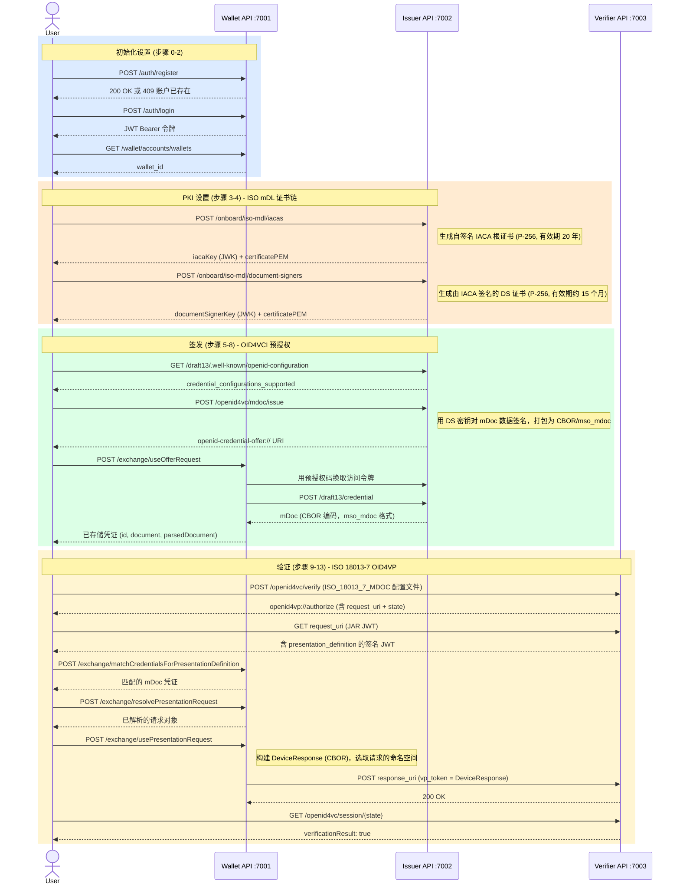
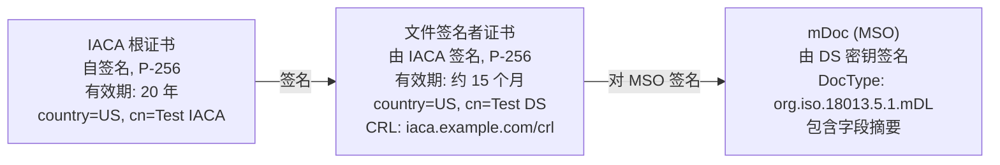
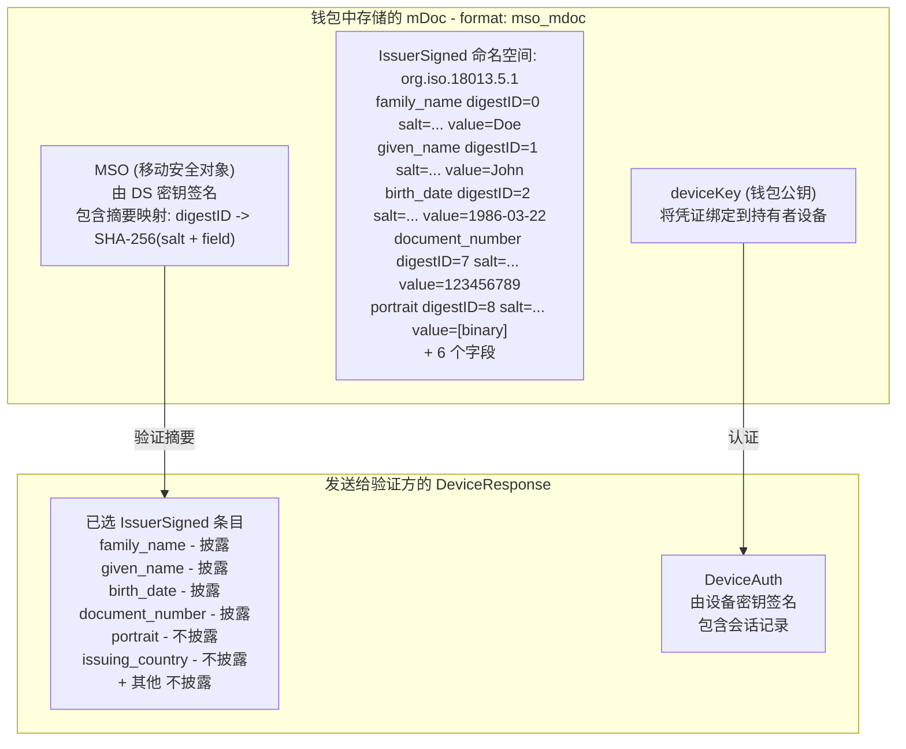

# ISO mDoc (mDL) 端到端流程 — 详细输入/输出参考

**脚本:** `test-mdoc-flow.sh`  
**规范:** ISO/IEC 18013-5 (mDL)、ISO 18013-7 (OID4VP 配置文件)、OID4VCI（预授权码）  
**运行命令:** `./test-mdoc-flow.sh [--verbose|-v] [email] [password]`

---

## 服务

| 服务           | 基础 URL                            | 用途                                  |
|--------------|-------------------------------------|---------------------------------------|
| Wallet API   | `http://localhost:7001/wallet-api`  | 持有者钱包（密钥、DID、凭证）             |
| Issuer API   | `http://localhost:7002`             | mDoc 凭证发行方                         |
| Verifier API | `http://localhost:7003`             | ISO 18013-7 OID4VP 验证方               |

---

## 流程概述



---

## 什么是 mDoc / mDL？

**mDoc**（移动文档）是由 **ISO/IEC 18013-5** 定义的凭证格式，最初专为移动驾驶执照（mDL）设计。与基于 JWT 的凭证不同，mDoc 使用 **CBOR**（简洁二进制对象表示）编码，并使用 X.509 证书链（而非 DID）来建立发行方信任。

核心概念：
- **命名空间 (Namespace)**：对相关字段进行分组的前缀，例如 `org.iso.18013.5.1` 用于标准 mDL 字段
- **IssuerSigned**：每个字段包含摘要 ID、随机盐值和字段值的 CBOR 结构，实现选择性披露
- **IACA**（签发机构证书颁发机构）：管辖区域的根证书颁发机构
- **DS**（文件签名者）：由 IACA 签名的证书，用于对各个 mDoc 签名
- **MSO**（移动安全对象）：将字段摘要与发行方证书绑定的已签名数据结构
- **DeviceResponse**：发送给验证方、包含所选命名空间的 CBOR 结构

---

## 证书链 (PKI)



---

## 逐步参考

---

### 步骤 0 — 注册账户

**目的：** 创建钱包账户。若账户已存在（HTTP 409），脚本无错误继续执行。

**输入 (POST `http://localhost:7001/wallet-api/auth/register`)：**
```json
{
  "type": "email",
  "name": "Test",
  "email": "test@email.com",
  "password": "test"
}
```

**输出：**
- HTTP 200/201 → 账户创建成功
- HTTP 409 → 账户已存在，脚本继续执行

**实际运行结果：**
```
HTTP 409 — account may already exist, continuing...
```

---

### 步骤 1 — 登录

**目的：** 进行身份验证，获取后续所有钱包 API 调用所需的 Bearer JWT。

**输入 (POST `http://localhost:7001/wallet-api/auth/login`)：**
```json
{
  "type": "email",
  "email": "test@email.com",
  "password": "test"
}
```

**输出：**
```json
{
  "id": "c798f9a8-32e1-40ec-b75a-67c3e21e332f",
  "token": "eyJhbGciOiJIUzI1NiJ9.eyJuYmYiOjE3Nzk2NzYwNzIs...",
  "username": "test@email.com"
}
```

`token` 是 HS256 JWT，作为 `Authorization: Bearer <token>` 用于所有钱包 API 调用。

---

### 步骤 2 — 获取钱包 ID

**目的：** 获取限定所有凭证和密钥操作范围的钱包 UUID。

**输入 (GET `http://localhost:7001/wallet-api/wallet/accounts/wallets`)：**  
无请求体。请求头中含 Bearer 令牌。

**输出：**
```json
{
  "account": "c798f9a8-32e1-40ec-b75a-67c3e21e332f",
  "wallets": [
    {
      "id": "c3419873-07be-419c-89ad-0b7a352f2d70",
      "name": "Wallet of Test",
      "createdOn": "2026-05-22T05:26:11.760032Z",
      "permission": "ADMINISTRATE"
    }
  ]
}
```

---

### 步骤 3 — 创建 IACA 证书

**目的：** 为 mDL 发行方提供根 PKI 证书。在实际部署中，每个管辖区域只需执行一次。IACA 密钥和证书用于在步骤 4 中对文件签名者证书进行签名。

**输入 (POST `http://localhost:7002/onboard/iso-mdl/iacas`)：**
```json
{
  "certificateData": {
    "country": "US",
    "commonName": "Test IACA",
    "issuerAlternativeNameConf": {
      "uri": "https://iaca.example.com"
    }
  }
}
```

**输出：**
```json
{
  "iacaKey": {
    "type": "jwk",
    "jwk": {
      "kty": "EC",
      "d": "ypdd4_DZ5rf6z90OO8xnS6QDXNY1sw-BrBQmGIT7pk8",
      "crv": "P-256",
      "kid": "cpzL1OLB4PXbNoF86Gd-CbmJNkGRazaJnEnEVONBavk",
      "x": "BaYKbiEcXwASyTqyaLRdDpLeJ2nTOeQw1m2GQoSZFe4",
      "y": "JITE5yhAWwLePk-Qr1v3G21Qz-R4_BByqGdPJj1mORQ"
    }
  },
  "certificatePEM": "-----BEGIN CERTIFICATE-----\nMIIBrzCCAVSgAwIBAgIU...\n-----END CERTIFICATE-----",
  "certificateData": {
    "country": "US",
    "commonName": "Test IACA",
    "notBefore": "2026-05-25T02:27:53Z",
    "notAfter": "2046-05-20T02:27:53Z",
    "issuerAlternativeNameConf": {
      "uri": "https://iaca.example.com"
    }
  }
}
```

关键字段：
- `iacaKey` — 用于步骤 4 对 DS 证书签名的私有 JWK (P-256)
- `certificatePEM` — X.509 PEM；作为受信根 CA 提供给验证方
- `notAfter` — 有效期 20 年

---

### 步骤 4 — 创建文件签名者证书

**目的：** 创建用于签发各个 mDoc 的叶签名密钥和证书。DS 证书由 IACA 签名，并链接到所签发 mDoc 的 `x5Chain` 中。

**输入 (POST `http://localhost:7002/onboard/iso-mdl/document-signers`)：**
```json
{
  "iacaSigner": {
    "iacaKey": { "type": "jwk", "jwk": { "kty": "EC", "crv": "P-256", "..." } },
    "certificateData": {
      "country": "US",
      "commonName": "Test IACA",
      "notBefore": "2026-05-25T02:27:53Z",
      "notAfter": "2046-05-20T02:27:53Z"
    }
  },
  "certificateData": {
    "country": "US",
    "commonName": "Test DS",
    "crlDistributionPointUri": "https://iaca.example.com/crl"
  }
}
```

**输出：**
```json
{
  "documentSignerKey": {
    "type": "jwk",
    "jwk": {
      "kty": "EC",
      "d": "8uJXfAORq0zuKIJfMy_YwPaTGJisVkmjkmpACwmjpfo",
      "crv": "P-256",
      "kid": "pM3e0DOGaJS3HqFkqvAu57-b-U-9KH9o0orcd9243gA",
      "x": "uGldPbKCeUqzrWpyWBdfaGOdYUmonJQW4sL7dNIu1UE",
      "y": "SD33xRiECruzKv4m2idsdpFWARaiDdAMsToOaWqgDHE"
    }
  },
  "certificatePEM": "-----BEGIN CERTIFICATE-----\nMIICATCCAaegAwIBAgIU...\n-----END CERTIFICATE-----",
  "certificateData": {
    "country": "US",
    "commonName": "Test DS",
    "notBefore": "2026-05-25T02:27:53Z",
    "notAfter": "2027-08-25T02:27:53Z",
    "crlDistributionPointUri": "https://iaca.example.com/crl"
  }
}
```

关键字段：
- `documentSignerKey` — 创建凭证提案时作为 `issuerKey` 使用的私有 JWK
- `certificatePEM` — 包含在 mDoc 的 `x5Chain` 中用于链式验证的 DS 证书
- `notAfter` — 有效期约 15 个月（短于 IACA）

---

### 步骤 5 — 获取发行方 Well-Known 配置

**目的：** 发现发行方支持的凭证端点、授权类型和凭证配置。

**输入 (GET `http://localhost:7002/draft13/.well-known/openid-configuration`)：**  
无请求体。

**输出（关键字段）：**
```json
{
  "issuer": "http://host.docker.internal:7002/draft13",
  "credential_endpoint": "http://host.docker.internal:7002/draft13/credential",
  "token_endpoint": "http://host.docker.internal:7002/draft13/token",
  "grant_types_supported": [
    "authorization_code",
    "urn:ietf:params:oauth:grant-type:pre-authorized_code"
  ]
}
```

> **注：** 发行方使用 `host.docker.internal` 是因为钱包 API 在 Docker 内部运行，需要访问宿主机。脚本通过对提案 URI 执行 `sed` 替换自动处理这一问题。

---

### 步骤 6 — 创建 mDL 凭证提案

**目的：** 签发 mDoc 凭证。发行方使用 DS 密钥对 mDL 数据签名，打包为 CBOR（mso_mdoc），并返回 OID4VCI 凭证提案 URI。

**输入 (POST `http://localhost:7002/openid4vc/mdoc/issue`)：**
```json
{
  "issuerKey": { "type": "jwk", "jwk": { "kty": "EC", "crv": "P-256", "..." } },
  "credentialConfigurationId": "org.iso.18013.5.1.mDL",
  "mdocData": {
    "org.iso.18013.5.1": {
      "family_name": "Doe",
      "given_name": "John",
      "birth_date": "1986-03-22",
      "issue_date": "2019-10-20",
      "expiry_date": "2030-10-20",
      "issuing_country": "US",
      "issuing_authority": "US DMV",
      "document_number": "123456789",
      "portrait": [141, 182, 121, ...],
      "driving_privileges": [
        { "vehicle_category_code": "B", "issue_date": "2019-10-20", "expiry_date": "2030-10-20" }
      ],
      "un_distinguishing_sign": "USA"
    }
  },
  "x5Chain": ["-----BEGIN CERTIFICATE-----\n... DS cert PEM ...\n-----END CERTIFICATE-----"],
  "authenticationMethod": "PRE_AUTHORIZED"
}
```

| 字段                       | 说明                                                       |
|---------------------------|----------------------------------------------------------|
| `issuerKey`               | 步骤 4 的 DS 私有 JWK — 对 MSO 签名                        |
| `credentialConfigurationId` | ISO docType `org.iso.18013.5.1.mDL`                    |
| `mdocData`                | 命名空间 → 字段映射；所有字段初始在 MSO 中哈希               |
| `x5Chain`                 | 用于链式验证的 DS 证书 PEM                                  |
| `authenticationMethod`    | `PRE_AUTHORIZED` — 签发时无需用户登录                       |

**输出：**
```
openid-credential-offer://?credential_offer_uri=http%3A%2F%2Fhost.docker.internal%3A7002%2Fdraft13%2FcredentialOffer%3Fid%3D70151c41-b101-4802-ba14-f080f6e7cd02
```

URI 使用 `credential_offer_uri`（间接引用）而非内联 `credential_offer`。钱包通过解引用此 URI 获取提案 JSON。

---

### 步骤 7 — 检查提案内容

**目的：** 解引用提案 URI，查看预授权码和授权详情。

本次运行中，由于使用的 URI 格式（`credential_offer_uri` 指向发行方端点）无法提取提案 ID，此步骤已跳过。当存在 `id` 参数时，发行方将返回：

```json
{
  "credential_issuer": "http://host.docker.internal:7002/draft13",
  "credential_configuration_ids": ["org.iso.18013.5.1.mDL"],
  "grants": {
    "urn:ietf:params:oauth:grant-type:pre-authorized_code": {
      "pre-authorized_code": "eyJ...",
      "interval": 5
    }
  }
}
```

---

### 步骤 8 — 将 mDL 凭证存入钱包

**目的：** 钱包用凭证提案换取实际的 mDoc。内部流程：获取提案 → 用预授权码换取访问令牌 → 调用凭证端点 → 存储 CBOR mDoc。

**输入 (POST `http://localhost:7001/wallet-api/wallet/{id}/exchange/useOfferRequest`)：**
```
openid-credential-offer://?credential_offer_uri=http%3A%2F%2Fhost.docker.internal%3A7002%2Fdraft13%2FcredentialOffer%3Fid%3D70151c41-b101-4802-ba14-f080f6e7cd02
```
（纯文本请求体 — 直接传入 URI 字符串）

**输出：**
```json
[
  {
    "wallet": "c3419873-07be-419c-89ad-0b7a352f2d70",
    "id": "a6efa136-86ba-49f9-9422-093813339ef1",
    "document": "a267646f6354797065756f72672e69736f2e31383031332e352e312e6d444c...",
    "addedOn": "2026-05-25T02:27:53.516842209Z",
    "pending": false,
    "format": "mso_mdoc",
    "parsedDocument": {
      "docType": "org.iso.18013.5.1.mDL",
      "issuerSigned": {
        "nameSpaces": {
          "org.iso.18013.5.1": [
            { "digestID": 0, "elementIdentifier": "family_name", "elementValue": "Doe" },
            { "digestID": 1, "elementIdentifier": "given_name", "elementValue": "John" },
            { "digestID": 2, "elementIdentifier": "birth_date", "elementValue": "1986-03-22" },
            { "digestID": 3, "elementIdentifier": "issue_date", "elementValue": "2019-10-20" },
            { "digestID": 4, "elementIdentifier": "expiry_date", "elementValue": "2030-10-20" },
            { "digestID": 5, "elementIdentifier": "issuing_country", "elementValue": "US" },
            { "digestID": 6, "elementIdentifier": "issuing_authority", "elementValue": "US DMV" },
            { "digestID": 7, "elementIdentifier": "document_number", "elementValue": "123456789" },
            { "digestID": 8, "elementIdentifier": "portrait", "elementValue": "[binary]" },
            { "digestID": 9, "elementIdentifier": "driving_privileges", "elementValue": "[...]" },
            { "digestID": 10, "elementIdentifier": "un_distinguishing_sign", "elementValue": "USA" }
          ]
        }
      },
      "deviceSigned": {},
      "docType": "org.iso.18013.5.1.mDL",
      "validityInfo": {
        "signed": "2026-05-25T02:27:53.503065209Z",
        "validFrom": "2026-05-25T02:27:53.503066250Z",
        "validUntil": "2027-05-25T02:27:53.503066417Z"
      },
      "deviceKeyInfo": {
        "deviceKey": { "kty": "EC", "crv": "P-256", "x": "...", "y": "..." }
      }
    }
  }
]
```

关键字段：
- `format: "mso_mdoc"` — 确认为 ISO mDoc（而非 JWT VC）
- `document` — 原始 CBOR 十六进制；完整的 IssuerSigned + MSO 结构
- `parsedDocument.issuerSigned.nameSpaces` — 每个字段有用于选择性披露的 `digestID` 和 `random`（盐值）
- `deviceKeyInfo.deviceKey` — 绑定到凭证的钱包公钥（用于设备认证）
- `validityInfo` — 默认有效期 1 年

---

### 步骤 9 — 创建 mDL 授权请求

**目的：** 验证方使用 **ISO 18013-7** 配置文件创建 OID4VP 授权请求，指定所需的 mDL 字段和受信任的 IACA 证书。

**输入 (POST `http://localhost:7003/openid4vc/verify`)：**
```
请求头:
  authorizeBaseUrl: openid4vp://authorize
  responseMode: direct_post_jwt
  openId4VPProfile: ISO_18013_7_MDOC
```
```json
{
  "request_credentials": [{
    "id": "mDL-request",
    "input_descriptor": {
      "id": "org.iso.18013.5.1.mDL",
      "format": { "mso_mdoc": { "alg": ["ES256"] } },
      "constraints": {
        "fields": [
          { "path": ["$['org.iso.18013.5.1']['family_name']"], "intent_to_retain": false },
          { "path": ["$['org.iso.18013.5.1']['given_name']"], "intent_to_retain": false },
          { "path": ["$['org.iso.18013.5.1']['birth_date']"], "intent_to_retain": false },
          { "path": ["$['org.iso.18013.5.1']['document_number']"], "intent_to_retain": false }
        ],
        "limit_disclosure": "required"
      }
    }
  }],
  "trusted_root_cas": ["-----BEGIN CERTIFICATE-----\n... IACA cert PEM ...\n-----END CERTIFICATE-----"],
  "openid_profile": "ISO_18013_7_MDOC"
}
```

| 字段               | 说明                                                        |
|--------------------|-----------------------------------------------------------|
| `openId4VPProfile` | `ISO_18013_7_MDOC` — 使用 ISO 18013-7 请求格式              |
| `format.mso_mdoc`  | 请求使用 ES256 算法的 mDoc 格式                               |
| `path`             | mDoc 命名空间的 JSONPath：`$['namespace']['field']`          |
| `limit_disclosure` | `required` — 只允许披露已列出的字段                           |
| `trusted_root_cas` | IACA PEM；验证方用于验证 MSO 链                               |

**输出：**
```
openid4vp://authorize?response_type=vp_token
  &client_id=http%3A%2F%2Fhost.docker.internal%3A7003%2Fopenid4vc%2Fverify
  &response_mode=direct_post_jwt
  &request_uri=http%3A%2F%2Fhost.docker.internal%3A7003%2Fopenid4vc%2Frequest%2F{state}
  &state={state}
```

ISO 18013-7 使用 `request_uri`（JAR — JWT 安全授权请求）而非内联 `presentation_definition`。state/会话 ID 是 `request_uri` 的最后一个路径段。

---

### 步骤 10 — 匹配表达定义中的凭证

**目的：** 从 `request_uri` 获取 JAR JWT，解码 JWT 载荷中的 `presentation_definition`，然后询问钱包哪些凭证匹配。

**步骤 10a — 获取 JAR JWT (GET `{request_uri}`)：**

验证方返回一个签名 JWT。其 base64url 解码后的载荷包含：
```json
{
  "presentation_definition": {
    "id": "...",
    "input_descriptors": [{
      "id": "org.iso.18013.5.1.mDL",
      "format": { "mso_mdoc": { "alg": ["ES256"] } },
      "constraints": { "fields": [...], "limit_disclosure": "required" }
    }]
  }
}
```

**步骤 10b — 匹配凭证 (POST `.../exchange/matchCredentialsForPresentationDefinition`)：**

> **注：** 如果钱包内部凭证索引不支持 `mso_mdoc` 格式，可能返回空结果。此时脚本回退到直接使用步骤 8 中获取的凭证 ID。

---

### 步骤 11 — 解析表达请求

**目的：** 钱包解析授权请求 URI，将完整的表达定义内联嵌入（用 `presentation_definition` 替换 `presentation_definition_uri`）。

**输入 (POST `.../exchange/resolvePresentationRequest`)：**  
请求体：原始 `openid4vp://authorize?...` URI 字符串

**输出：** 包含 URL 编码内联 `presentation_definition` JSON 的展开版 `openid4vp://authorize?...` URI，供步骤 12 构建响应使用。

---

### 步骤 12 — 履行 mDL 表达请求

**目的：** 钱包构建只包含所请求命名空间字段的 CBOR **DeviceResponse**，并 POST 到验证方的 `response_uri`。

**输入 (POST `.../exchange/usePresentationRequest`)：**
```json
{
  "presentationRequest": "openid4vp://authorize?...&presentation_definition=...",
  "selectedCredentials": ["a6efa136-86ba-49f9-9422-093813339ef1"]
}
```

钱包内部处理：
1. 解析 `presentation_definition` 以确定包含哪些命名空间字段
2. 构建 DeviceResponse，`IssuerSigned` 条目仅包含所请求字段（`family_name`、`given_name`、`birth_date`、`document_number`）
3. 使用设备密钥签名（设备认证）
4. 将 CBOR DeviceResponse 作为 `vp_token` POST 到 `response_uri`

**输出：**
```json
{ "redirectUri": null }
```

---

### 步骤 13 — 验证 mDL 表达

**目的：** 轮询验证方的会话端点，确认 mDoc 表达已被接受。

**输入 (GET `http://localhost:7003/openid4vc/session/{state}`)：**  
无请求体。

**输出：**
```json
{
  "id": "{state}",
  "verificationResult": true
}
```

验证方校验内容：
1. CBOR 结构和 MSO 签名（DS 密钥 → IACA 链）
2. IACA 证书与步骤 9 提供的 `trusted_root_cas` 匹配
3. DeviceResponse 中包含所有请求字段
4. 设备认证签名有效

---

## mDoc 结构图



---

## 与 SD-JWT VC 流程的对比

| 方面               | SD-JWT VC                     | ISO mDoc                              |
|--------------------|-------------------------------|---------------------------------------|
| **编码格式**        | JWT (Base64url)               | CBOR（二进制）                         |
| **发行方信任**      | DID + JWK                     | X.509 证书链（IACA → DS）              |
| **选择性披露**      | JWT 体中的 `_sd` 哈希数组      | MSO 中的 `digestID` 映射               |
| **持有者绑定**      | KB-JWT（密钥绑定 JWT）         | DeviceAuth（设备密钥签名）              |
| **VP 格式**         | JWT + 披露字符串               | CBOR DeviceResponse                   |
| **OID4VP 配置文件** | 默认 / PE 2.0                  | `ISO_18013_7_MDOC`                    |
| **字段路径**        | JSONPath `$.field`            | `$['namespace']['field']`             |
| **密钥算法**        | ES256 (secp256r1)             | ES256 (P-256) + X.509 证书            |
