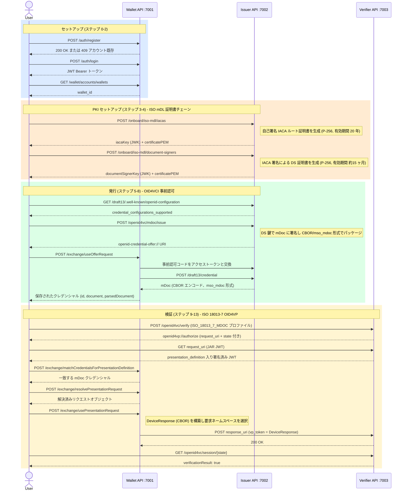
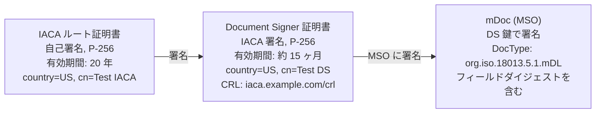
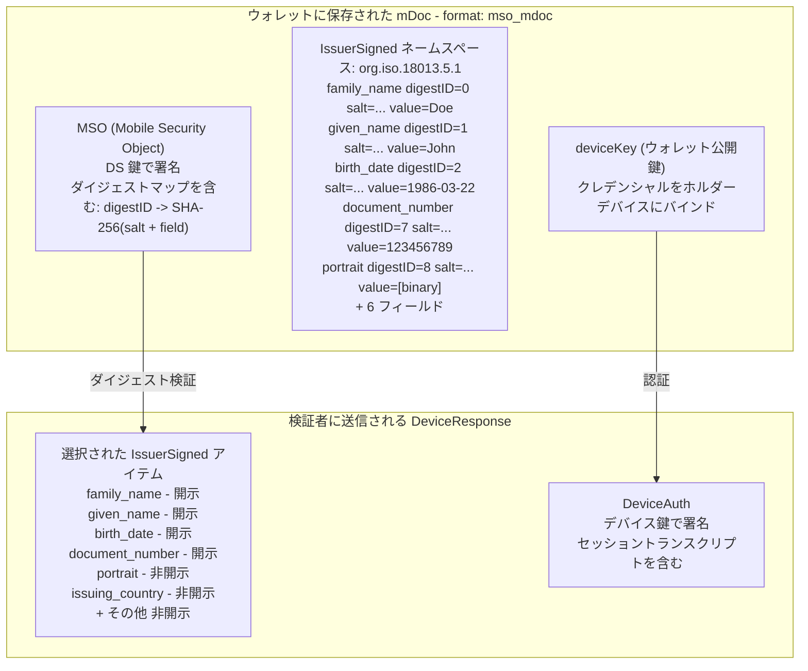

# ISO mDoc (mDL) エンドツーエンドフロー — 詳細入出力リファレンス

**スクリプト:** `test-mdoc-flow.sh`  
**仕様:** ISO/IEC 18013-5 (mDL)、ISO 18013-7 (OID4VP プロファイル)、OID4VCI (事前認可コード)  
**実行コマンド:** `./test-mdoc-flow.sh [--verbose|-v] [email] [password]`

---

## サービス

| サービス       | ベース URL                          | 用途                                  |
|--------------|-------------------------------------|---------------------------------------|
| Wallet API   | `http://localhost:7001/wallet-api`  | ホルダーウォレット（鍵、DID、クレデンシャル）|
| Issuer API   | `http://localhost:7002`             | mDoc クレデンシャル発行者               |
| Verifier API | `http://localhost:7003`             | ISO 18013-7 OID4VP 検証者              |

---

## フロー概要



---

## mDoc / mDL とは？

**mDoc** (モバイルドキュメント) は、**ISO/IEC 18013-5** で定義されたクレデンシャル形式で、元々はモバイル運転免許証 (mDL) 向けに設計されました。JWT ベースのクレデンシャルとは異なり、mDoc は **CBOR** (Concise Binary Object Representation) でエンコードされ、発行者の信頼には DID の代わりに X.509 証明書チェーンを使用します。

主要概念:
- **ネームスペース (Namespace)**: 関連フィールドをグループ化するプレフィックス。例: `org.iso.18013.5.1` は標準 mDL フィールド用
- **IssuerSigned**: 各フィールドにダイジェスト ID・ランダムソルト・値を持つ CBOR 構造。選択的開示を実現
- **IACA** (発行機関認証局): 管轄のルート認証局
- **DS** (Document Signer): IACA に署名された証明書。個々の mDoc に署名するために使用
- **MSO** (Mobile Security Object): フィールドダイジェストを発行者証明書に結びつける署名済みデータ構造
- **DeviceResponse**: 選択されたネームスペースを含む、検証者に送信される CBOR 構造

---

## 証明書チェーン (PKI)



---

## ステップ別リファレンス

---

### ステップ 0 — アカウント登録

**目的:** ウォレットアカウントを作成します。アカウントが既に存在する場合 (HTTP 409)、スクリプトはエラーなく続行します。

**入力 (POST `http://localhost:7001/wallet-api/auth/register`):**
```json
{
  "type": "email",
  "name": "Test",
  "email": "test@email.com",
  "password": "test"
}
```

**出力:**
- HTTP 200/201 → アカウント作成
- HTTP 409 → アカウント既存。スクリプト続行

**実際の実行結果:**
```
HTTP 409 — account may already exist, continuing...
```

---

### ステップ 1 — ログイン

**目的:** 認証を行い、以降のウォレット API 呼び出しに使用する Bearer JWT を取得します。

**入力 (POST `http://localhost:7001/wallet-api/auth/login`):**
```json
{
  "type": "email",
  "email": "test@email.com",
  "password": "test"
}
```

**出力:**
```json
{
  "id": "c798f9a8-32e1-40ec-b75a-67c3e21e332f",
  "token": "eyJhbGciOiJIUzI1NiJ9.eyJuYmYiOjE3Nzk2NzYwNzIs...",
  "username": "test@email.com"
}
```

`token` は HS256 JWT であり、すべてのウォレット API 呼び出しで `Authorization: Bearer <token>` として使用します。

---

### ステップ 2 — ウォレット ID の取得

**目的:** すべてのクレデンシャル・鍵操作のスコープとなるウォレット UUID を取得します。

**入力 (GET `http://localhost:7001/wallet-api/wallet/accounts/wallets`):**  
ボディなし。ヘッダーに Bearer トークン。

**出力:**
```json
{
  "account": "c798f9a8-32e1-40ec-b75a-67c3e21e332f",
  "wallets": [
    {
      "id": "c3419873-07be-419c-89ad-0b7a352f2d70",
      "name": "Wallet of Test",
      "createdOn": "2026-05-22T05:26:11.760032Z",
      "permission": "ADMINISTRATE"
    }
  ]
}
```

---

### ステップ 3 — IACA 証明書の作成

**目的:** mDL 発行者のルート PKI 証明書をプロビジョニングします。実際の運用では管轄ごとに一度だけ実施します。IACA 鍵と証明書は、ステップ 4 で Document Signer 証明書に署名するために必要です。

**入力 (POST `http://localhost:7002/onboard/iso-mdl/iacas`):**
```json
{
  "certificateData": {
    "country": "US",
    "commonName": "Test IACA",
    "issuerAlternativeNameConf": {
      "uri": "https://iaca.example.com"
    }
  }
}
```

**出力:**
```json
{
  "iacaKey": {
    "type": "jwk",
    "jwk": {
      "kty": "EC",
      "d": "ypdd4_DZ5rf6z90OO8xnS6QDXNY1sw-BrBQmGIT7pk8",
      "crv": "P-256",
      "kid": "cpzL1OLB4PXbNoF86Gd-CbmJNkGRazaJnEnEVONBavk",
      "x": "BaYKbiEcXwASyTqyaLRdDpLeJ2nTOeQw1m2GQoSZFe4",
      "y": "JITE5yhAWwLePk-Qr1v3G21Qz-R4_BByqGdPJj1mORQ"
    }
  },
  "certificatePEM": "-----BEGIN CERTIFICATE-----\nMIIBrzCCAVSgAwIBAgIU...\n-----END CERTIFICATE-----",
  "certificateData": {
    "country": "US",
    "commonName": "Test IACA",
    "notBefore": "2026-05-25T02:27:53Z",
    "notAfter": "2046-05-20T02:27:53Z",
    "issuerAlternativeNameConf": {
      "uri": "https://iaca.example.com"
    }
  }
}
```

主要フィールド:
- `iacaKey` — ステップ 4 で DS 証明書に署名するための秘密 JWK (P-256)
- `certificatePEM` — X.509 PEM。検証者に信頼済みルート CA として提供
- `notAfter` — 有効期間 20 年

---

### ステップ 4 — Document Signer 証明書の作成

**目的:** 個々の mDoc を発行するためのリーフ署名鍵と証明書を作成します。DS 証明書は IACA に署名され、発行された mDoc の `x5Chain` にチェーンされます。

**入力 (POST `http://localhost:7002/onboard/iso-mdl/document-signers`):**
```json
{
  "iacaSigner": {
    "iacaKey": { "type": "jwk", "jwk": { "kty": "EC", "crv": "P-256", "..." } },
    "certificateData": {
      "country": "US",
      "commonName": "Test IACA",
      "notBefore": "2026-05-25T02:27:53Z",
      "notAfter": "2046-05-20T02:27:53Z"
    }
  },
  "certificateData": {
    "country": "US",
    "commonName": "Test DS",
    "crlDistributionPointUri": "https://iaca.example.com/crl"
  }
}
```

**出力:**
```json
{
  "documentSignerKey": {
    "type": "jwk",
    "jwk": {
      "kty": "EC",
      "d": "8uJXfAORq0zuKIJfMy_YwPaTGJisVkmjkmpACwmjpfo",
      "crv": "P-256",
      "kid": "pM3e0DOGaJS3HqFkqvAu57-b-U-9KH9o0orcd9243gA",
      "x": "uGldPbKCeUqzrWpyWBdfaGOdYUmonJQW4sL7dNIu1UE",
      "y": "SD33xRiECruzKv4m2idsdpFWARaiDdAMsToOaWqgDHE"
    }
  },
  "certificatePEM": "-----BEGIN CERTIFICATE-----\nMIICATCCAaegAwIBAgIU...\n-----END CERTIFICATE-----",
  "certificateData": {
    "country": "US",
    "commonName": "Test DS",
    "notBefore": "2026-05-25T02:27:53Z",
    "notAfter": "2027-08-25T02:27:53Z",
    "crlDistributionPointUri": "https://iaca.example.com/crl"
  }
}
```

主要フィールド:
- `documentSignerKey` — クレデンシャルオファー作成時に `issuerKey` として使用される秘密 JWK
- `certificatePEM` — チェーン検証のために mDoc の `x5Chain` に含まれる DS 証明書
- `notAfter` — 有効期間 約 15 ヶ月 (IACA より短い)

---

### ステップ 5 — 発行者 Well-Known 設定の取得

**目的:** 発行者がサポートするクレデンシャルエンドポイント、グラントタイプ、クレデンシャル設定を検出します。

**入力 (GET `http://localhost:7002/draft13/.well-known/openid-configuration`):**  
ボディなし。

**出力 (主要フィールド):**
```json
{
  "issuer": "http://host.docker.internal:7002/draft13",
  "credential_endpoint": "http://host.docker.internal:7002/draft13/credential",
  "token_endpoint": "http://host.docker.internal:7002/draft13/token",
  "grant_types_supported": [
    "authorization_code",
    "urn:ietf:params:oauth:grant-type:pre-authorized_code"
  ]
}
```

> **注:** 発行者が `host.docker.internal` を使用するのは、ウォレット API が Docker 内で動作しておりホストへアクセスする必要があるためです。スクリプトはオファー URI に対して `sed` 置換で自動的に処理します。

---

### ステップ 6 — mDL クレデンシャルオファーの作成

**目的:** mDoc クレデンシャルを発行します。発行者は DS 鍵を使って mDL データに署名し、CBOR (mso_mdoc) としてパッケージ化して OID4VCI クレデンシャルオファー URI を返します。

**入力 (POST `http://localhost:7002/openid4vc/mdoc/issue`):**
```json
{
  "issuerKey": { "type": "jwk", "jwk": { "kty": "EC", "crv": "P-256", "..." } },
  "credentialConfigurationId": "org.iso.18013.5.1.mDL",
  "mdocData": {
    "org.iso.18013.5.1": {
      "family_name": "Doe",
      "given_name": "John",
      "birth_date": "1986-03-22",
      "issue_date": "2019-10-20",
      "expiry_date": "2030-10-20",
      "issuing_country": "US",
      "issuing_authority": "US DMV",
      "document_number": "123456789",
      "portrait": [141, 182, 121, ...],
      "driving_privileges": [
        { "vehicle_category_code": "B", "issue_date": "2019-10-20", "expiry_date": "2030-10-20" }
      ],
      "un_distinguishing_sign": "USA"
    }
  },
  "x5Chain": ["-----BEGIN CERTIFICATE-----\n... DS cert PEM ...\n-----END CERTIFICATE-----"],
  "authenticationMethod": "PRE_AUTHORIZED"
}
```

| フィールド                  | 説明                                                         |
|---------------------------|--------------------------------------------------------------|
| `issuerKey`               | ステップ 4 の DS 秘密 JWK — MSO に署名                        |
| `credentialConfigurationId` | ISO docType `org.iso.18013.5.1.mDL`                        |
| `mdocData`                | ネームスペース → フィールドマップ。全フィールドは MSO でハッシュ化 |
| `x5Chain`                 | チェーン検証用 DS 証明書 PEM                                   |
| `authenticationMethod`    | `PRE_AUTHORIZED` — 発行にユーザーログイン不要                   |

**出力:**
```
openid-credential-offer://?credential_offer_uri=http%3A%2F%2Fhost.docker.internal%3A7002%2Fdraft13%2FcredentialOffer%3Fid%3D70151c41-b101-4802-ba14-f080f6e7cd02
```

URI はインライン `credential_offer` ではなく `credential_offer_uri` (間接参照) を使用します。ウォレットはこの URI を逆参照してオファー JSON を取得します。

---

### ステップ 7 — オファー内容の確認

**目的:** オファー URI を逆参照して、事前認可コードとグラント詳細を確認します。

今回の実行では、使用された URI 形式 (`credential_offer_uri` 形式でイシュアーエンドポイントを指す) からオファー ID を抽出できなかったため、このステップはスキップされました。`id` パラメータがある場合、発行者は以下を返します:

```json
{
  "credential_issuer": "http://host.docker.internal:7002/draft13",
  "credential_configuration_ids": ["org.iso.18013.5.1.mDL"],
  "grants": {
    "urn:ietf:params:oauth:grant-type:pre-authorized_code": {
      "pre-authorized_code": "eyJ...",
      "interval": 5
    }
  }
}
```

---

### ステップ 8 — ウォレットへの mDL クレデンシャルの取り込み

**目的:** ウォレットがクレデンシャルオファーを実際の mDoc と交換します。内部的にウォレットはオファーを取得 → 事前認可コードをアクセストークンと交換 → クレデンシャルエンドポイントを呼び出し → CBOR mDoc を保存します。

**入力 (POST `http://localhost:7001/wallet-api/wallet/{id}/exchange/useOfferRequest`):**
```
openid-credential-offer://?credential_offer_uri=http%3A%2F%2Fhost.docker.internal%3A7002%2Fdraft13%2FcredentialOffer%3Fid%3D70151c41-b101-4802-ba14-f080f6e7cd02
```
(プレーンテキストボディ — URI 文字列をそのまま)

**出力:**
```json
[
  {
    "wallet": "c3419873-07be-419c-89ad-0b7a352f2d70",
    "id": "a6efa136-86ba-49f9-9422-093813339ef1",
    "document": "a267646f6354797065756f72672e69736f2e31383031332e352e312e6d444c...",
    "addedOn": "2026-05-25T02:27:53.516842209Z",
    "pending": false,
    "format": "mso_mdoc",
    "parsedDocument": {
      "docType": "org.iso.18013.5.1.mDL",
      "issuerSigned": {
        "nameSpaces": {
          "org.iso.18013.5.1": [
            { "digestID": 0, "elementIdentifier": "family_name", "elementValue": "Doe" },
            { "digestID": 1, "elementIdentifier": "given_name", "elementValue": "John" },
            { "digestID": 2, "elementIdentifier": "birth_date", "elementValue": "1986-03-22" },
            { "digestID": 3, "elementIdentifier": "issue_date", "elementValue": "2019-10-20" },
            { "digestID": 4, "elementIdentifier": "expiry_date", "elementValue": "2030-10-20" },
            { "digestID": 5, "elementIdentifier": "issuing_country", "elementValue": "US" },
            { "digestID": 6, "elementIdentifier": "issuing_authority", "elementValue": "US DMV" },
            { "digestID": 7, "elementIdentifier": "document_number", "elementValue": "123456789" },
            { "digestID": 8, "elementIdentifier": "portrait", "elementValue": "[binary]" },
            { "digestID": 9, "elementIdentifier": "driving_privileges", "elementValue": "[...]" },
            { "digestID": 10, "elementIdentifier": "un_distinguishing_sign", "elementValue": "USA" }
          ]
        }
      },
      "deviceSigned": {},
      "docType": "org.iso.18013.5.1.mDL",
      "validityInfo": {
        "signed": "2026-05-25T02:27:53.503065209Z",
        "validFrom": "2026-05-25T02:27:53.503066250Z",
        "validUntil": "2027-05-25T02:27:53.503066417Z"
      },
      "deviceKeyInfo": {
        "deviceKey": { "kty": "EC", "crv": "P-256", "x": "...", "y": "..." }
      }
    }
  }
]
```

主要フィールド:
- `format: "mso_mdoc"` — ISO mDoc であることを確認 (JWT VC ではない)
- `document` — 生の CBOR hex。IssuerSigned + MSO 構造全体
- `parsedDocument.issuerSigned.nameSpaces` — 各フィールドに選択的開示用の `digestID` と `random` (ソルト) を持つ
- `deviceKeyInfo.deviceKey` — クレデンシャルにバインドされたウォレットの公開鍵 (デバイス認証用)
- `validityInfo` — デフォルトで 1 年間有効

---

### ステップ 9 — mDL 認可リクエストの作成

**目的:** 検証者が **ISO 18013-7** プロファイルを使用して OID4VP 認可リクエストを作成します。要求する mDL フィールドと信頼する IACA 証明書を指定します。

**入力 (POST `http://localhost:7003/openid4vc/verify`):**
```
ヘッダー:
  authorizeBaseUrl: openid4vp://authorize
  responseMode: direct_post_jwt
  openId4VPProfile: ISO_18013_7_MDOC
```
```json
{
  "request_credentials": [{
    "id": "mDL-request",
    "input_descriptor": {
      "id": "org.iso.18013.5.1.mDL",
      "format": { "mso_mdoc": { "alg": ["ES256"] } },
      "constraints": {
        "fields": [
          { "path": ["$['org.iso.18013.5.1']['family_name']"], "intent_to_retain": false },
          { "path": ["$['org.iso.18013.5.1']['given_name']"], "intent_to_retain": false },
          { "path": ["$['org.iso.18013.5.1']['birth_date']"], "intent_to_retain": false },
          { "path": ["$['org.iso.18013.5.1']['document_number']"], "intent_to_retain": false }
        ],
        "limit_disclosure": "required"
      }
    }
  }],
  "trusted_root_cas": ["-----BEGIN CERTIFICATE-----\n... IACA cert PEM ...\n-----END CERTIFICATE-----"],
  "openid_profile": "ISO_18013_7_MDOC"
}
```

| フィールド          | 説明                                                       |
|--------------------|----------------------------------------------------------|
| `openId4VPProfile` | `ISO_18013_7_MDOC` — ISO 18013-7 リクエスト形式を使用      |
| `format.mso_mdoc`  | ES256 アルゴリズムで mDoc 形式を要求                         |
| `path`             | mDoc ネームスペースへの JSONPath: `$['namespace']['field']`  |
| `limit_disclosure` | `required` — 列挙されたフィールドのみ開示可能                |
| `trusted_root_cas` | IACA PEM。検証者が MSO チェーンの検証に使用                  |

**出力:**
```
openid4vp://authorize?response_type=vp_token
  &client_id=http%3A%2F%2Fhost.docker.internal%3A7003%2Fopenid4vc%2Fverify
  &response_mode=direct_post_jwt
  &request_uri=http%3A%2F%2Fhost.docker.internal%3A7003%2Fopenid4vc%2Frequest%2F{state}
  &state={state}
```

ISO 18013-7 はインラインの `presentation_definition` の代わりに `request_uri` (JAR — JWT Secured Authorization Request) を使用します。state/セッション ID は `request_uri` の最後のパスセグメントです。

---

### ステップ 10 — プレゼンテーション定義に対するクレデンシャルの照合

**目的:** `request_uri` から JAR JWT を取得し、JWT ペイロードの `presentation_definition` をデコードして、ウォレットに一致するクレデンシャルを問い合わせます。

**ステップ 10a — JAR JWT の取得 (GET `{request_uri}`):**

検証者は署名済み JWT を返します。その base64url デコードされたペイロードには以下が含まれます:
```json
{
  "presentation_definition": {
    "id": "...",
    "input_descriptors": [{
      "id": "org.iso.18013.5.1.mDL",
      "format": { "mso_mdoc": { "alg": ["ES256"] } },
      "constraints": { "fields": [...], "limit_disclosure": "required" }
    }]
  }
}
```

**ステップ 10b — クレデンシャル照合 (POST `.../exchange/matchCredentialsForPresentationDefinition`):**

> **注:** ウォレットの内部クレデンシャルインデックスが `mso_mdoc` 形式をサポートしていない場合、空を返すことがあります。その場合、スクリプトはステップ 8 で取得したクレデンシャル ID を直接使用するフォールバック処理を行います。

---

### ステップ 11 — プレゼンテーションリクエストの解決

**目的:** ウォレットが認可リクエスト URI を解決し、プレゼンテーション定義をインラインで埋め込みます (`presentation_definition_uri` を `presentation_definition` に置換)。

**入力 (POST `.../exchange/resolvePresentationRequest`):**  
ボディ: 生の `openid4vp://authorize?...` URI 文字列

**出力:** `presentation_definition` JSON が URL エンコードされてインラインに含まれた展開済み `openid4vp://authorize?...` URI。ステップ 12 でのレスポンス構築に使用されます。

---

### ステップ 12 — mDL プレゼンテーションリクエストの履行

**目的:** ウォレットが要求されたネームスペースフィールドのみを含む CBOR **DeviceResponse** を構築し、検証者の `response_uri` に POST します。

**入力 (POST `.../exchange/usePresentationRequest`):**
```json
{
  "presentationRequest": "openid4vp://authorize?...&presentation_definition=...",
  "selectedCredentials": ["a6efa136-86ba-49f9-9422-093813339ef1"]
}
```

ウォレット内部の処理:
1. `presentation_definition` を解析し、含めるネームスペースフィールドを決定
2. 要求されたフィールド (`family_name`、`given_name`、`birth_date`、`document_number`) のみの `IssuerSigned` アイテムで DeviceResponse を構築
3. デバイス鍵で署名 (デバイス認証)
4. CBOR DeviceResponse を `vp_token` として `response_uri` に POST

**出力:**
```json
{ "redirectUri": null }
```

---

### ステップ 13 — mDL プレゼンテーションの検証

**目的:** 検証者のセッションエンドポイントをポーリングし、mDoc プレゼンテーションが受け入れられたことを確認します。

**入力 (GET `http://localhost:7003/openid4vc/session/{state}`):**  
ボディなし。

**出力:**
```json
{
  "id": "{state}",
  "verificationResult": true
}
```

検証者が検証する項目:
1. CBOR 構造と MSO 署名 (DS 鍵 → IACA チェーン)
2. IACA 証明書がステップ 9 で指定した `trusted_root_cas` と一致すること
3. すべての要求フィールドが DeviceResponse に含まれていること
4. デバイス認証署名が有効であること

---

## mDoc 構造図



---

## SD-JWT VC フローとの比較

| 項目                | SD-JWT VC                    | ISO mDoc                              |
|---------------------|------------------------------|---------------------------------------|
| **エンコード**       | JWT (Base64url)              | CBOR (バイナリ)                        |
| **発行者の信頼**     | DID + JWK                    | X.509 証明書チェーン (IACA → DS)       |
| **選択的開示**       | JWT ボディの `_sd` ハッシュ配列 | MSO 内の `digestID` マップ             |
| **ホルダーバインド** | KB-JWT (Key Binding JWT)     | DeviceAuth (デバイス鍵署名)            |
| **VP 形式**         | JWT + 開示文字列              | CBOR DeviceResponse                   |
| **OID4VP プロファイル** | デフォルト / PE 2.0        | `ISO_18013_7_MDOC`                    |
| **フィールドパス**   | JSONPath `$.field`           | `$['namespace']['field']`             |
| **鍵アルゴリズム**   | ES256 (secp256r1)            | ES256 (P-256) + X.509 証明書          |
