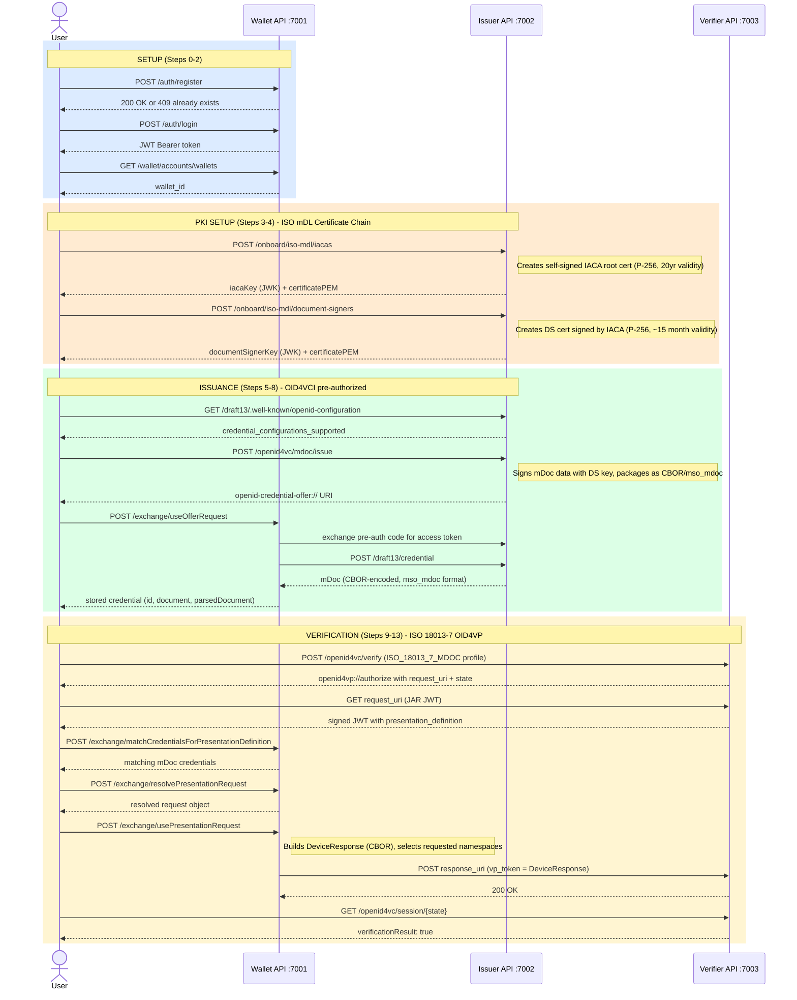
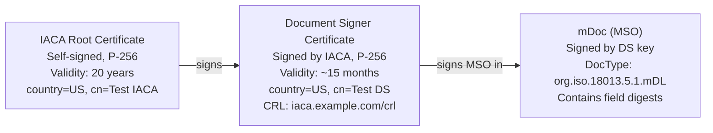
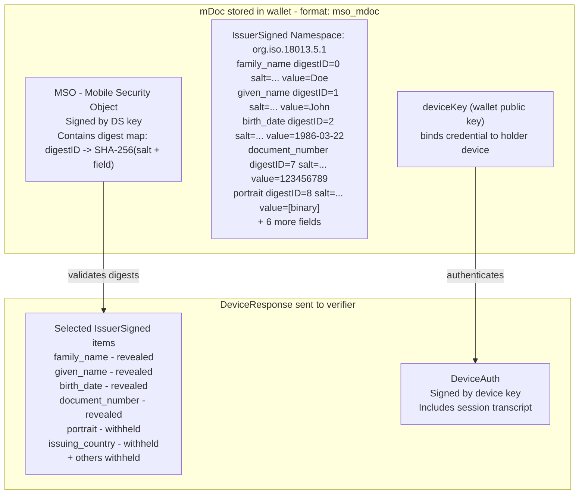

# ISO mDoc (mDL) End-to-End Flow — Detailed Input/Output Reference

**Script:** `test-mdoc-flow.sh`  
**Spec:** ISO/IEC 18013-5 (mDL), ISO 18013-7 (OID4VP profile), OID4VCI (pre-authorized code)  
**Run command:** `./test-mdoc-flow.sh [--verbose|-v] [email] [password]`  
**Log file:** `test-mdoc-flow.log` — captured with `./test-mdoc-flow.sh --verbose > test-mdoc-flow.log 2>&1`

---

## Services

| Service      | Base URL                            | Purpose                           |
|--------------|-------------------------------------|-----------------------------------|
| Wallet API   | `http://localhost:7001/wallet-api`  | Holder wallet (keys, DIDs, creds) |
| Issuer API   | `http://localhost:7002`             | mDoc credential issuer            |
| Verifier API | `http://localhost:7003`             | ISO 18013-7 OID4VP verifier       |

---

## Flow Overview



---

## What is mDoc / mDL?

An **mDoc** (Mobile Document) is a credential format defined by **ISO/IEC 18013-5**, originally designed for mobile driver's licenses (mDL). Unlike JWT-based credentials, mDocs are encoded in **CBOR** (Concise Binary Object Representation) and use a certificate chain (X.509) for issuer trust instead of DIDs.

Key concepts:
- **Namespace**: A prefix grouping related fields, e.g. `org.iso.18013.5.1` for standard mDL fields
- **IssuerSigned**: CBOR structure where each field has a digest ID, random salt, and value — enabling selective disclosure
- **IACA** (Issuing Authority Certification Authority): The root certificate authority for a jurisdiction
- **DS** (Document Signer): A certificate signed by the IACA, used to sign individual mDocs
- **MSO** (Mobile Security Object): The signed data structure binding field digests to the issuer certificate
- **DeviceResponse**: The CBOR structure sent to the verifier, containing selected namespaces

---

## Certificate Chain (PKI)



---

## Step-by-Step Reference

---

### Step 0 — Register Account

**Purpose:** Create a wallet account. If the account already exists (HTTP 409), the script continues without error.

**Input (POST `http://localhost:7001/wallet-api/auth/register`):**
```json
{
  "type": "email",
  "name": "Test",
  "email": "test@email.com",
  "password": "test"
}
```

**Output:**
- HTTP 200/201 → account created
- HTTP 409 → account already exists; script continues

**Actual result from run:**
```
HTTP 409 — account may already exist, continuing...
```

---

### Step 1 — Login

**Purpose:** Authenticate and obtain a Bearer JWT for all subsequent wallet API calls.

**Input (POST `http://localhost:7001/wallet-api/auth/login`):**
```json
{
  "type": "email",
  "email": "test@email.com",
  "password": "test"
}
```

**Output:**
```json
{
  "id": "c798f9a8-32e1-40ec-b75a-67c3e21e332f",
  "token": "eyJhbGciOiJIUzI1NiJ9.eyJuYmYiOjE3Nzk2NzYwNzIs...",
  "username": "test@email.com"
}
```

The `token` is a HS256 JWT used as `Authorization: Bearer <token>` on all wallet API calls.

---

### Step 2 — Retrieve Wallet ID

**Purpose:** Get the wallet UUID that scopes all credential and key operations.

**Input (GET `http://localhost:7001/wallet-api/wallet/accounts/wallets`):**  
No body. Bearer token in header.

**Output:**
```json
{
  "account": "c798f9a8-32e1-40ec-b75a-67c3e21e332f",
  "wallets": [
    {
      "id": "c3419873-07be-419c-89ad-0b7a352f2d70",
      "name": "Wallet of Test",
      "createdOn": "2026-05-22T05:26:11.760032Z",
      "permission": "ADMINISTRATE"
    }
  ]
}
```

---

### Step 3 — Create IACA Certificate

**Purpose:** Provision the root PKI certificate for the mDL issuer. In a real deployment this is done once per jurisdiction. The IACA key and certificate are needed to sign the Document Signer certificate.

**Input (POST `http://localhost:7002/onboard/iso-mdl/iacas`):**
```json
{
  "certificateData": {
    "country": "US",
    "commonName": "Test IACA",
    "issuerAlternativeNameConf": {
      "uri": "https://iaca.example.com"
    }
  }
}
```

**Output:**
```json
{
  "iacaKey": {
    "type": "jwk",
    "jwk": {
      "kty": "EC",
      "d": "ypdd4_DZ5rf6z90OO8xnS6QDXNY1sw-BrBQmGIT7pk8",
      "crv": "P-256",
      "kid": "cpzL1OLB4PXbNoF86Gd-CbmJNkGRazaJnEnEVONBavk",
      "x": "BaYKbiEcXwASyTqyaLRdDpLeJ2nTOeQw1m2GQoSZFe4",
      "y": "JITE5yhAWwLePk-Qr1v3G21Qz-R4_BByqGdPJj1mORQ"
    }
  },
  "certificatePEM": "-----BEGIN CERTIFICATE-----\nMIIBrzCCAVSgAwIBAgIU...\n-----END CERTIFICATE-----",
  "certificateData": {
    "country": "US",
    "commonName": "Test IACA",
    "notBefore": "2026-05-25T02:27:53Z",
    "notAfter": "2046-05-20T02:27:53Z",
    "issuerAlternativeNameConf": {
      "uri": "https://iaca.example.com"
    }
  }
}
```

Key fields:
- `iacaKey` — private JWK (P-256) used to sign the DS certificate in Step 4
- `certificatePEM` — X.509 PEM; provided to verifier as trusted root CA
- `notAfter` — 20-year validity period

---

### Step 4 — Create Document Signer Certificate

**Purpose:** Create the leaf signing key and certificate for issuing individual mDocs. The DS cert is signed by the IACA and chained in the issued mDoc's `x5Chain`.

**Input (POST `http://localhost:7002/onboard/iso-mdl/document-signers`):**
```json
{
  "iacaSigner": {
    "iacaKey": { "type": "jwk", "jwk": { "kty": "EC", "crv": "P-256", "..." } },
    "certificateData": {
      "country": "US",
      "commonName": "Test IACA",
      "notBefore": "2026-05-25T02:27:53Z",
      "notAfter": "2046-05-20T02:27:53Z"
    }
  },
  "certificateData": {
    "country": "US",
    "commonName": "Test DS",
    "crlDistributionPointUri": "https://iaca.example.com/crl"
  }
}
```

**Output:**
```json
{
  "documentSignerKey": {
    "type": "jwk",
    "jwk": {
      "kty": "EC",
      "d": "8uJXfAORq0zuKIJfMy_YwPaTGJisVkmjkmpACwmjpfo",
      "crv": "P-256",
      "kid": "pM3e0DOGaJS3HqFkqvAu57-b-U-9KH9o0orcd9243gA",
      "x": "uGldPbKCeUqzrWpyWBdfaGOdYUmonJQW4sL7dNIu1UE",
      "y": "SD33xRiECruzKv4m2idsdpFWARaiDdAMsToOaWqgDHE"
    }
  },
  "certificatePEM": "-----BEGIN CERTIFICATE-----\nMIICATCCAaegAwIBAgIU...\n-----END CERTIFICATE-----",
  "certificateData": {
    "country": "US",
    "commonName": "Test DS",
    "notBefore": "2026-05-25T02:27:53Z",
    "notAfter": "2027-08-25T02:27:53Z",
    "crlDistributionPointUri": "https://iaca.example.com/crl"
  }
}
```

Key fields:
- `documentSignerKey` — private JWK used as the `issuerKey` when creating the credential offer
- `certificatePEM` — DS certificate included in the mDoc's `x5Chain` for chain validation
- `notAfter` — ~15-month validity (shorter than IACA)

---

### Step 5 — Retrieve Issuer Well-Known Config

**Purpose:** Discover the credential endpoint, supported grant types, and credential configurations supported by the issuer.

**Input (GET `http://localhost:7002/draft13/.well-known/openid-configuration`):**  
No body.

**Output (key fields):**
```json
{
  "issuer": "http://host.docker.internal:7002/draft13",
  "credential_endpoint": "http://host.docker.internal:7002/draft13/credential",
  "token_endpoint": "http://host.docker.internal:7002/draft13/token",
  "grant_types_supported": [
    "authorization_code",
    "urn:ietf:params:oauth:grant-type:pre-authorized_code"
  ]
}
```

> **Note:** The issuer uses `host.docker.internal` because the wallet API runs inside Docker and needs to reach the host. The script handles this automatically with a `sed` replacement on the offer URI.

---

### Step 6 — Create mDL Credential Offer

**Purpose:** Issue an mDoc credential. The issuer signs the mDL data using the DS key, packages it as CBOR (mso_mdoc), and returns an OID4VCI credential offer URI.

**Input (POST `http://localhost:7002/openid4vc/mdoc/issue`):**
```json
{
  "issuerKey": { "type": "jwk", "jwk": { "kty": "EC", "crv": "P-256", "..." } },
  "credentialConfigurationId": "org.iso.18013.5.1.mDL",
  "mdocData": {
    "org.iso.18013.5.1": {
      "family_name": "Doe",
      "given_name": "John",
      "birth_date": "1986-03-22",
      "issue_date": "2019-10-20",
      "expiry_date": "2030-10-20",
      "issuing_country": "US",
      "issuing_authority": "US DMV",
      "document_number": "123456789",
      "portrait": [141, 182, 121, ...],
      "driving_privileges": [
        { "vehicle_category_code": "B", "issue_date": "2019-10-20", "expiry_date": "2030-10-20" }
      ],
      "un_distinguishing_sign": "USA"
    }
  },
  "x5Chain": ["-----BEGIN CERTIFICATE-----\n... DS cert PEM ...\n-----END CERTIFICATE-----"],
  "authenticationMethod": "PRE_AUTHORIZED"
}
```

| Field                     | Description                                               |
|---------------------------|-----------------------------------------------------------|
| `issuerKey`               | DS private JWK from Step 4 — signs the MSO               |
| `credentialConfigurationId` | ISO docType `org.iso.18013.5.1.mDL`                    |
| `mdocData`                | Namespace → field map; all fields initially hashed in MSO |
| `x5Chain`                 | DS certificate PEM for chain validation                   |
| `authenticationMethod`    | `PRE_AUTHORIZED` — no user login required for issuance    |

**Output:**
```
openid-credential-offer://?credential_offer_uri=http%3A%2F%2Fhost.docker.internal%3A7002%2Fdraft13%2FcredentialOffer%3Fid%3D70151c41-b101-4802-ba14-f080f6e7cd02
```

The URI uses `credential_offer_uri` (indirect reference) rather than inline `credential_offer`. The wallet fetches the offer JSON by dereferencing this URI.

---

### Step 7 — Inspect Offer Content

**Purpose:** Dereference the offer URI to view the pre-authorized code and grant details.

In this run the offer ID could not be extracted from the URI format used (the URI uses `credential_offer_uri` pointing to the issuer's endpoint), so this step was skipped. When an `id` parameter is present the issuer would return:

```json
{
  "credential_issuer": "http://host.docker.internal:7002/draft13",
  "credential_configuration_ids": ["org.iso.18013.5.1.mDL"],
  "grants": {
    "urn:ietf:params:oauth:grant-type:pre-authorized_code": {
      "pre-authorized_code": "eyJ...",
      "interval": 5
    }
  }
}
```

---

### Step 8 — Claim mDL Credential into Wallet

**Purpose:** The wallet exchanges the credential offer for the actual mDoc. Internally the wallet: fetches the offer → exchanges pre-auth code for access token → calls the credential endpoint → stores the CBOR mDoc.

**Input (POST `http://localhost:7001/wallet-api/wallet/{id}/exchange/useOfferRequest`):**
```
openid-credential-offer://?credential_offer_uri=http%3A%2F%2Fhost.docker.internal%3A7002%2Fdraft13%2FcredentialOffer%3Fid%3D70151c41-b101-4802-ba14-f080f6e7cd02
```
(plain text body — the URI string directly)

**Output:**
```json
[
  {
    "wallet": "c3419873-07be-419c-89ad-0b7a352f2d70",
    "id": "a6efa136-86ba-49f9-9422-093813339ef1",
    "document": "a267646f6354797065756f72672e69736f2e31383031332e352e312e6d444c...",
    "addedOn": "2026-05-25T02:27:53.516842209Z",
    "pending": false,
    "format": "mso_mdoc",
    "parsedDocument": {
      "docType": "org.iso.18013.5.1.mDL",
      "issuerSigned": {
        "nameSpaces": {
          "org.iso.18013.5.1": [
            { "digestID": 0, "elementIdentifier": "family_name", "elementValue": "Doe" },
            { "digestID": 1, "elementIdentifier": "given_name", "elementValue": "John" },
            { "digestID": 2, "elementIdentifier": "birth_date", "elementValue": "1986-03-22" },
            { "digestID": 3, "elementIdentifier": "issue_date", "elementValue": "2019-10-20" },
            { "digestID": 4, "elementIdentifier": "expiry_date", "elementValue": "2030-10-20" },
            { "digestID": 5, "elementIdentifier": "issuing_country", "elementValue": "US" },
            { "digestID": 6, "elementIdentifier": "issuing_authority", "elementValue": "US DMV" },
            { "digestID": 7, "elementIdentifier": "document_number", "elementValue": "123456789" },
            { "digestID": 8, "elementIdentifier": "portrait", "elementValue": "[binary]" },
            { "digestID": 9, "elementIdentifier": "driving_privileges", "elementValue": "[...]" },
            { "digestID": 10, "elementIdentifier": "un_distinguishing_sign", "elementValue": "USA" }
          ]
        }
      },
      "deviceSigned": {},
      "docType": "org.iso.18013.5.1.mDL",
      "validityInfo": {
        "signed": "2026-05-25T02:27:53.503065209Z",
        "validFrom": "2026-05-25T02:27:53.503066250Z",
        "validUntil": "2027-05-25T02:27:53.503066417Z"
      },
      "deviceKeyInfo": {
        "deviceKey": { "kty": "EC", "crv": "P-256", "x": "...", "y": "..." }
      }
    }
  }
]
```

Key fields:
- `format: "mso_mdoc"` — confirms this is an ISO mDoc (not JWT VC)
- `document` — raw CBOR hex; the full IssuerSigned + MSO structure
- `parsedDocument.issuerSigned.nameSpaces` — each field has a `digestID` and `random` (salt) for selective disclosure
- `deviceKeyInfo.deviceKey` — the wallet's public key bound to the credential (for device authentication)
- `validityInfo` — 1-year validity by default

---

### Step 9 — Create mDL Authorization Request

**Purpose:** The verifier creates an OID4VP authorization request using the **ISO 18013-7** profile. It specifies which mDL fields to request and which IACA certificate to trust.

**Input (POST `http://localhost:7003/openid4vc/verify`):**
```
Headers:
  authorizeBaseUrl: openid4vp://authorize
  responseMode: direct_post_jwt
  openId4VPProfile: ISO_18013_7_MDOC
```
```json
{
  "request_credentials": [{
    "id": "mDL-request",
    "input_descriptor": {
      "id": "org.iso.18013.5.1.mDL",
      "format": { "mso_mdoc": { "alg": ["ES256"] } },
      "constraints": {
        "fields": [
          { "path": ["$['org.iso.18013.5.1']['family_name']"], "intent_to_retain": false },
          { "path": ["$['org.iso.18013.5.1']['given_name']"], "intent_to_retain": false },
          { "path": ["$['org.iso.18013.5.1']['birth_date']"], "intent_to_retain": false },
          { "path": ["$['org.iso.18013.5.1']['document_number']"], "intent_to_retain": false }
        ],
        "limit_disclosure": "required"
      }
    }
  }],
  "trusted_root_cas": ["-----BEGIN CERTIFICATE-----\n... IACA cert PEM ...\n-----END CERTIFICATE-----"],
  "openid_profile": "ISO_18013_7_MDOC"
}
```

| Field              | Description                                              |
|--------------------|----------------------------------------------------------|
| `openId4VPProfile` | `ISO_18013_7_MDOC` — uses ISO 18013-7 request format    |
| `format.mso_mdoc`  | Requests mDoc format with ES256 algorithm                |
| `path`             | JSONPath into mDoc namespace: `$['namespace']['field']`  |
| `limit_disclosure` | `required` — only the listed fields may be revealed      |
| `trusted_root_cas` | IACA PEM; verifier uses this to validate the MSO chain   |

**Output:**
```
openid4vp://authorize?response_type=vp_token
  &client_id=http%3A%2F%2Fhost.docker.internal%3A7003%2Fopenid4vc%2Fverify
  &response_mode=direct_post_jwt
  &request_uri=http%3A%2F%2Fhost.docker.internal%3A7003%2Fopenid4vc%2Frequest%2F{state}
  &state={state}
```

ISO 18013-7 uses `request_uri` (JAR — JWT Secured Authorization Request) instead of inline `presentation_definition`. The state/session ID is the last path segment of `request_uri`.

---

### Step 10 — Match Credentials for Presentation Definition

**Purpose:** Fetch the JAR JWT from `request_uri`, decode the `presentation_definition` from the JWT payload, then ask the wallet which credentials match.

**Step 10a — Fetch JAR JWT (GET `{request_uri}`):**

The verifier returns a signed JWT. Its base64url-decoded payload contains:
```json
{
  "presentation_definition": {
    "id": "...",
    "input_descriptors": [{
      "id": "org.iso.18013.5.1.mDL",
      "format": { "mso_mdoc": { "alg": ["ES256"] } },
      "constraints": { "fields": [...], "limit_disclosure": "required" }
    }]
  }
}
```

**Step 10b — Match Credentials (POST `.../exchange/matchCredentialsForPresentationDefinition`):**

> **Note:** The wallet may return empty for `mso_mdoc` format if its internal credential index does not support that format. In that case, the script falls back to using the claimed credential ID from Step 8 directly.

---

### Step 11 — Resolve Presentation Request

**Purpose:** The wallet resolves the authorization request URI, fetching and embedding the full presentation definition inline (replacing `presentation_definition_uri` with `presentation_definition`).

**Input (POST `.../exchange/resolvePresentationRequest`):**  
Body: the raw `openid4vp://authorize?...` URI string

**Output:** An expanded `openid4vp://authorize?...` URI with the `presentation_definition` JSON URL-encoded inline. Used in Step 12 to build the response.

---

### Step 12 — Fulfill mDL Presentation Request

**Purpose:** The wallet builds a CBOR **DeviceResponse** containing only the requested namespace fields, and POSTs it to the verifier's `response_uri`.

**Input (POST `.../exchange/usePresentationRequest`):**
```json
{
  "presentationRequest": "openid4vp://authorize?...&presentation_definition=...",
  "selectedCredentials": ["a6efa136-86ba-49f9-9422-093813339ef1"]
}
```

Internally the wallet:
1. Parses the `presentation_definition` to determine which namespace fields to include
2. Builds a DeviceResponse with `IssuerSigned` items only for the requested fields (`family_name`, `given_name`, `birth_date`, `document_number`)
3. Signs with the device key (device authentication)
4. POSTs the CBOR DeviceResponse as `vp_token` to the `response_uri`

**Output:**
```json
{ "redirectUri": null }
```

---

### Step 13 — Verify mDL Presentation

**Purpose:** Poll the verifier's session endpoint to confirm the mDoc presentation was accepted.

**Input (GET `http://localhost:7003/openid4vc/session/{state}`):**  
No body.

**Output:**
```json
{
  "id": "{state}",
  "verificationResult": true
}
```

The verifier validates:
1. CBOR structure and MSO signature (DS key → IACA chain)
2. IACA certificate matches the `trusted_root_cas` supplied in Step 9
3. All requested fields are present in the DeviceResponse
4. Device authentication signature is valid

---

## mDoc Structure Diagram



---

## Differences from SD-JWT VC Flow

| Aspect              | SD-JWT VC                    | ISO mDoc                             |
|---------------------|------------------------------|--------------------------------------|
| **Encoding**        | JWT (Base64url)              | CBOR (binary)                        |
| **Issuer trust**    | DID + JWK                    | X.509 certificate chain (IACA → DS)  |
| **Selective disc.** | `_sd` hash array in JWT body | `digestID` map in MSO                |
| **Holder binding**  | KB-JWT (Key Binding JWT)     | DeviceAuth (device key signature)    |
| **VP format**       | JWT + disclosure strings     | CBOR DeviceResponse                  |
| **OID4VP profile**  | Default / PE 2.0             | `ISO_18013_7_MDOC`                   |
| **Field paths**     | JSONPath `$.field`           | `$['namespace']['field']`            |
| **Key algorithm**   | ES256 (secp256r1)            | ES256 (P-256) + X.509 cert           |

---

## Verbose Mode

Run with `--verbose` or `-v` to enable per-step request/response logging:

```bash
./test-mdoc-flow.sh --verbose
```

To capture all output to a plain-text log file:

```bash
./test-mdoc-flow.sh --verbose > test-mdoc-flow.log 2>&1
```

> Colors are automatically disabled when stdout is redirected, so the log file contains clean plain text.

Each step prints:
```
  ┌── Step N ─── METHOD URL
  │  REQUEST:
  │   { ... json ... }
  │  RESPONSE:
  │   { ... json ... }
  └──
```

The verbose log is also written as JSON to `demo/mdoc-steps.json` on successful completion.
