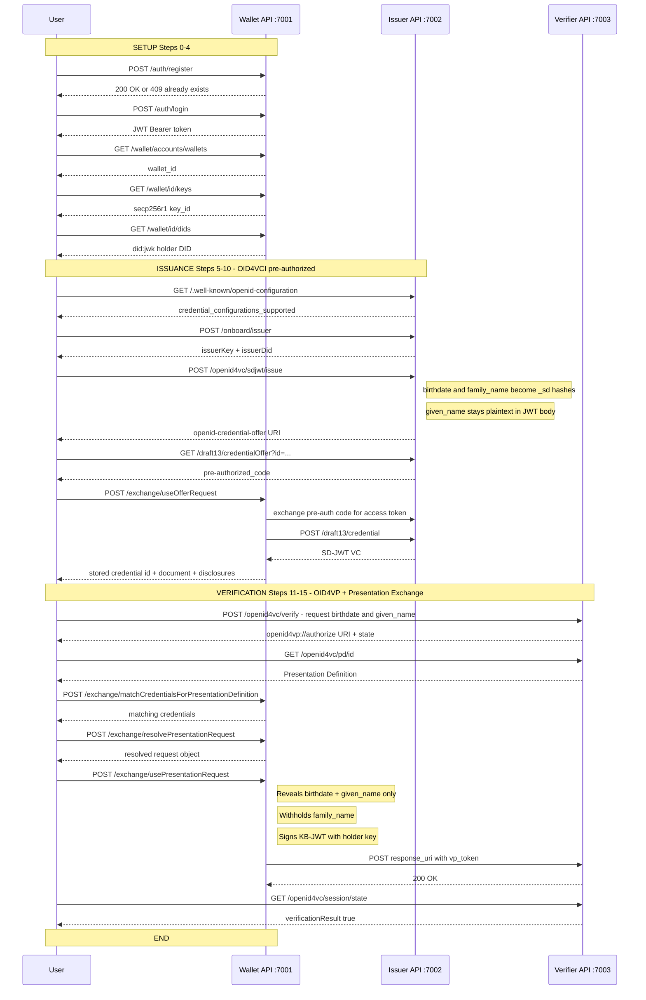
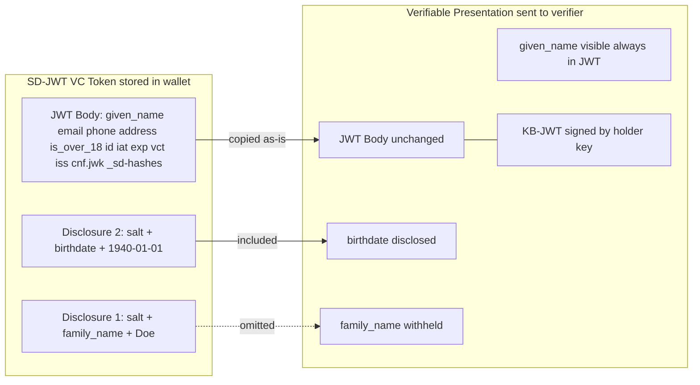

# SD-JWT VC End-to-End Flow — Detailed Input/Output Reference

**Script:** `test-sd-jwt-flow.sh`  
**Spec:** IETF SD-JWT VC (draft-ietf-oauth-sd-jwt-vc), OID4VCI (pre-authorized code), OID4VP (Presentation Exchange)  
**Run command:** `./test-sd-jwt-flow.sh [--verbose|-v] [email] [password]`

---

## Services

| Service     | Base URL                            | Purpose                           |
|-------------|-------------------------------------|-----------------------------------|
| Wallet API  | `http://localhost:7001/wallet-api`  | Holder wallet (keys, DIDs, creds) |
| Issuer API  | `http://localhost:7002`             | SD-JWT VC credential issuer       |
| Verifier API| `http://localhost:7003`             | OID4VP verifier                   |

---

## Flow Overview



---

## Selective Disclosure Detail



---

## Step-by-Step Details

---

### Step 0 — Register Account

**Purpose:** Register a new wallet user account. Skipped gracefully if already exists (HTTP 409).

**Input (POST `http://localhost:7001/wallet-api/auth/register`):**
```json
{
  "type": "email",
  "name": "Test",
  "email": "test@email.com",
  "password": "test"
}
```

| Field      | Type   | Description                          |
|------------|--------|--------------------------------------|
| `type`     | string | Auth method; always `"email"` here   |
| `name`     | string | Display name for the account         |
| `email`    | string | Login email (set by `$EMAIL` arg)    |
| `password` | string | Password (set by `$PASSWORD` arg)    |

**Output:**
- HTTP 200/201 → account created
- HTTP 409 → account already exists; script logs a warning and continues

**Actual result from run:**
```
HTTP 409 — account may already exist, continuing...
```

---

### Step 1 — Login

**Purpose:** Authenticate and obtain a Bearer JWT for all subsequent wallet API calls.

**Input (POST `http://localhost:7001/wallet-api/auth/login`):**
```json
{
  "type": "email",
  "email": "test@email.com",
  "password": "test"
}
```

**Output:**
```json
{
  "id": "c798f9a8-32e1-40ec-b75a-67c3e21e332f",
  "token": "eyJhbGciOiJIUzI1NiJ9.eyJuYmYiOjE3Nzk2NzE0MDcsImV4cCI6MTc4MjI2MzQwNywi...",
  "username": "test@email.com"
}
```

| Field      | Description                                    |
|------------|------------------------------------------------|
| `id`       | Account UUID; used to look up wallets          |
| `token`    | HS256-signed JWT; valid for ~30 days           |
| `username` | Echo of the login email                        |

**Token claims (decoded):**
- `sub`: account UUID (`c798f9a8-...`)
- `iss` / `aud`: `http://host.docker.internal:7001`
- `exp`: `nbf` + 30 days

**Variable set:** `$TOKEN` — appended as `Authorization: Bearer $TOKEN` on all wallet API calls.

---

### Step 2 — Retrieve Wallet ID

**Purpose:** Discover the wallet UUID owned by the authenticated account.

**Input (GET `http://localhost:7001/wallet-api/wallet/accounts/wallets`):**
- Header: `Authorization: Bearer $TOKEN`

**Output:**
```json
{
  "account": "c798f9a8-32e1-40ec-b75a-67c3e21e332f",
  "wallets": [
    {
      "id": "c3419873-07be-419c-89ad-0b7a352f2d70",
      "name": "Wallet of Test",
      "createdOn": "2026-05-22T05:26:11.760032Z",
      "addedOn": "2026-05-22T05:26:11.762032Z",
      "permission": "ADMINISTRATE"
    }
  ]
}
```

**Variable set:** `$WALLET_ID` = `c3419873-07be-419c-89ad-0b7a352f2d70`

---

### Step 3 — Retrieve Key

**Purpose:** Fetch the cryptographic key associated with the wallet (used for DID:JWK resolution and key binding in SD-JWT VCs).

**Input (GET `http://localhost:7001/wallet-api/wallet/$WALLET_ID/keys`):**
- Header: `Authorization: Bearer $TOKEN`

**Output:**
```json
[
  {
    "algorithm": "secp256r1",
    "cryptoProvider": "[walt.id crypto private secp256r1 key]",
    "keyId": {
      "id": "kePnU9VEoCX4byyuLOczT1G1LOUJxWYH82EmNeOYvog"
    },
    "keyPair": {},
    "keysetHandle": null
  }
]
```

| Field          | Description                                               |
|----------------|-----------------------------------------------------------|
| `algorithm`    | `secp256r1` (NIST P-256 / ES256)                          |
| `keyId.id`     | Base64url-encoded key thumbprint used in DID:JWK and `cnf` |
| `keyPair`      | Empty — private key not exposed in API response           |
| `keysetHandle` | Tink keyset handle; null here (plain key)                 |

**Variable set:** `$KEY_ID` = `kePnU9VEoCX4byyuLOczT1G1LOUJxWYH82EmNeOYvog`

---

### Step 4 — Retrieve DID

**Purpose:** Fetch the wallet holder's DID for use in key binding and credential presentation.

**Input (GET `http://localhost:7001/wallet-api/wallet/$WALLET_ID/dids`):**
- Header: `Authorization: Bearer $TOKEN`

**Output (abbreviated):**
```json
[
  {
    "did": "did:jwk:eyJrdHkiOiJFQyIsImNydiI6IlAtMjU2IiwieCI6IlQwaUdrS2cyWkpoeDhWVk5MWHFuV1YxdGlwLWZYSzNDdkVCY2pRdzNOQjgiLCJ5IjoiQnF6MERNbVdoS0NRbE90NWoyVjZEN19oZGhlUWx4QllJQVNJQWdwUVpfdyJ9",
    "alias": "Onboarding",
    "default": true,
    "keyId": "kePnU9VEoCX4byyuLOczT1G1LOUJxWYH82EmNeOYvog",
    "document": "{...full DID document...}"
  }
]
```

**DID:JWK decoded key:**
```json
{
  "kty": "EC",
  "crv": "P-256",
  "kid": "kePnU9VEoCX4byyuLOczT1G1LOUJxWYH82EmNeOYvog",
  "x": "T0iGkKg2ZJhx8VVNLXqnWV1tip-fXK3CvEBcjQw3NB8",
  "y": "Bqz0DMmWhKCQlOt5j2V6D7_hdheQlxBYIASIAgpQZ_w"
}
```

The `did:jwk` method encodes the full public key JWK as base64url in the DID string. The DID Document has `verificationMethod`, `assertionMethod`, `authentication`, `capabilityInvocation`, `capabilityDelegation`, and `keyAgreement` all pointing to the same P-256 key.

**Variable set:** `$DID` = holder's `did:jwk:...`

---

### Step 5 — Retrieve Issuer Well-Known Config

**Purpose:** Confirm the Issuer API's OID4VCI metadata (supported credential formats, token endpoint, etc.).

**Input (GET `http://localhost:7002/draft13/.well-known/openid-configuration`):**

**Output (key fields):**
```json
{
  "issuer": "http://host.docker.internal:7002",
  "credential_issuer": "http://host.docker.internal:7002",
  "credential_endpoint": "http://host.docker.internal:7002/draft13/credential",
  "token_endpoint": "http://host.docker.internal:7002/token",
  "credential_configurations_supported": {
    "identity_credential_vc+sd-jwt": {
      "format": "vc+sd-jwt",
      "vct": "http://host.docker.internal:7002/identity_credential",
      "cryptographic_binding_methods_supported": ["did:jwk"],
      "credential_signing_alg_values_supported": ["ES256"]
    }
  }
}
```

This step is informational — it confirms the `credentialConfigurationId` (`identity_credential_vc+sd-jwt`) that will be used in Step 7.

---

### Step 6 — Onboard Issuer

**Purpose:** Generate a new issuer key pair and DID:JWK. This simulates a new issuer being registered each run.

**Input (POST `http://localhost:7002/onboard/issuer`):**
```json
{
  "key": {
    "keyType": "secp256r1"
  }
}
```

**Output:**
```json
{
  "issuerKey": {
    "type": "jwk",
    "jwk": {
      "kty": "EC",
      "crv": "P-256",
      "kid": "_jzsW3cmLwg2Qi7SBIdAYBb6cWZ0vXO3zmDBDfC4pSA",
      "d": "<private key — not shown in docs>",
      "x": "LR9a1AB3zzBWvRgEEyUzEtgmznlgQVMWlc-FG1aSl9A",
      "y": "FPYTbHl1RFD65SLNR_AlYE_wbUsXc7ZYZuSNzidWEvs"
    }
  },
  "issuerDid": "did:jwk:eyJrdHkiOiJFQyIsImNydiI6IlAtMjU2IiwieCI6IkxSOWExQUIzenp..."
}
```

**Variables set:**
- `$ISSUER_KEY` — full JWK object (including private key `d`)
- `$ISSUER_DID` — the issuer's `did:jwk:...`

---

### Step 7 — Create SD-JWT VC Credential Offer

**Purpose:** Request the issuer to generate an OID4VCI credential offer. The offer URI is a deep link that the wallet uses to claim the credential.

**Input (POST `http://localhost:7002/openid4vc/sdjwt/issue`):**
```json
{
  "issuerKey": { "type": "jwk", "jwk": { ...P-256 JWK with private key... } },
  "issuerDid": "did:jwk:eyJ...",
  "credentialConfigurationId": "identity_credential_vc+sd-jwt",
  "credentialData": {
    "given_name": "John",
    "family_name": "Doe",
    "email": "johndoe@example.com",
    "phone_number": "+1-202-555-0101",
    "address": {
      "street_address": "123 Main St",
      "locality": "Anytown",
      "region": "Anystate",
      "country": "US"
    },
    "birthdate": "1940-01-01",
    "is_over_18": true,
    "is_over_21": true,
    "is_over_65": true
  },
  "mapping": {
    "id": "<uuid>",
    "iat": "<timestamp-seconds>",
    "nbf": "<timestamp-seconds>",
    "exp": "<timestamp-in-seconds:365d>"
  },
  "selectiveDisclosure": {
    "fields": {
      "birthdate":   { "sd": true },
      "family_name": { "sd": true },
      "given_name":  { "sd": false }
    }
  },
  "authenticationMethod": "PRE_AUTHORIZED"
}
```

**Key input fields:**

| Field                      | Description                                                                 |
|----------------------------|-----------------------------------------------------------------------------|
| `credentialConfigurationId`| Identifies the credential type; must match issuer metadata                 |
| `credentialData`           | The actual identity claims to include in the credential                     |
| `mapping.id`               | `<uuid>` — auto-generates a `urn:uuid:...` as the credential ID             |
| `mapping.exp`              | `<timestamp-in-seconds:365d>` — sets expiry 365 days from now              |
| `selectiveDisclosure.fields` | Controls which claims are SD-protected vs. always disclosed              |
| `authenticationMethod`     | `PRE_AUTHORIZED` — wallet gets a pre-auth code, no user interaction needed |

**Selective Disclosure mapping:**

| Claim         | `sd: true` → SD-protected  | `sd: false` → always in JWT payload |
|---------------|----------------------------|------------------------------------|
| `birthdate`   | ✓ Hashed in `_sd` array    |                                    |
| `family_name` | ✓ Hashed in `_sd` array    |                                    |
| `given_name`  |                            | ✓ Plaintext in JWT body            |
| All others    |                            | ✓ Plaintext in JWT body (default)  |

**Output:**
```
openid-credential-offer://?credential_offer_uri=http%3A%2F%2Fhost.docker.internal%3A7002%2Fdraft13%2FcredentialOffer%3Fid%3D9fcfffb0-5fd3-490e-9fab-f086c738b47d
```

This is a `openid-credential-offer://` deep link URI. The wallet fetches the actual offer object from the embedded `credential_offer_uri`. The `localhost` → `host.docker.internal` rewrite is needed because the wallet API runs inside Docker.

---

### Step 8/9 — Inspect Offer Content

**Purpose:** Fetch and display the credential offer object by extracting the `id` from the offer URI.

**Input (GET `http://localhost:7002/draft13/credentialOffer?id=9fcfffb0-5fd3-490e-9fab-f086c738b47d`):**

**Output:**
```json
{
  "credential_issuer": "http://host.docker.internal:7002",
  "credential_configuration_ids": ["identity_credential_vc+sd-jwt"],
  "grants": {
    "urn:ietf:params:oauth:grant-type:pre-authorized_code": {
      "pre-authorized_code": "<one-time-use code>",
      "user_pin_required": false
    }
  }
}
```

| Field                       | Description                                                    |
|-----------------------------|----------------------------------------------------------------|
| `credential_configuration_ids` | The credential type(s) offered                              |
| `pre-authorized_code`       | One-time code the wallet exchanges for an access token        |
| `user_pin_required`         | `false` — no PIN needed for this test flow                    |

---

### Step 10 — Claim SD-JWT VC into Wallet

**Purpose:** The wallet uses the credential offer URI to run the full OID4VCI pre-authorized code flow internally: exchanges the pre-auth code for an access token, then calls the credential endpoint to receive and store the SD-JWT VC.

**Input (POST `http://localhost:7001/wallet-api/wallet/$WALLET_ID/exchange/useOfferRequest`):**
- Header: `Authorization: Bearer $TOKEN`
- Body: the full `openid-credential-offer://` URI string (with `localhost` rewritten to `host.docker.internal`)

**Output (abbreviated):**
```json
[
  {
    "wallet": "c3419873-07be-419c-89ad-0b7a352f2d70",
    "id": "urn:uuid:fb55c3d6-f47e-43e1-b442-b865244673d1",
    "document": "eyJraWQiOiJkaWQ6andrOi...<base64url-encoded SD-JWT>",
    "disclosures": "WyJiZkNNUThWUVA4RFVzVmhDeFo2XzJRIiwiZmFtaWx5X25hbWUiLCJEb2UiXQ~WyJ0WVUtb0hDUF9SWFBsMkk2RThfOVlRIiwiYmlydGhkYXRlIiwiMTk0MC0wMS0wMSJd",
    "addedOn": "2026-05-25T01:10:07.822608Z",
    "pending": false,
    "format": "vc+sd-jwt",
    "parsedDocument": {
      "given_name": "John",
      "email": "johndoe@example.com",
      "phone_number": "+1-202-555-0101",
      "address": { "street_address": "123 Main St", "locality": "Anytown", "region": "Anystate", "country": "US" },
      "is_over_18": true,
      "is_over_21": true,
      "is_over_65": true,
      "id": "urn:uuid:fb55c3d6-f47e-43e1-b442-b865244673d1",
      "iat": 1779671407,
      "nbf": 1779671407,
      "exp": 1811207407,
      "_sd_alg": "sha-256",
      "iss": "did:jwk:eyJ...<issuer DID>",
      "cnf": {
        "jwk": {
          "kty": "EC", "crv": "P-256",
          "kid": "kePnU9VEoCX4byyuLOczT1G1LOUJxWYH82EmNeOYvog",
          "x": "T0iGkKg2ZJhx8VVNLXqnWV1tip-fXK3CvEBcjQw3NB8",
          "y": "Bqz0DMmWhKCQlOt5j2V6D7_hdheQlxBYIASIAgpQZ_w"
        }
      },
      "vct": "http://host.docker.internal:7002/identity_credential",
      "_sd": [
        "kkhePkYbYXUN_GD8gxTMklZeuMzr7KtlTPVRLcIaJ-A",
        "3dC2o9bo9hTC5z9JMm8b3fElKfvsJwEQp998RLaVGYE"
      ]
    }
  }
]
```

**Key output fields:**

| Field          | Description                                                              |
|----------------|--------------------------------------------------------------------------|
| `id`           | Credential ID (`urn:uuid:...`) — used to select the credential for presentation |
| `document`     | The raw SD-JWT token: `<JWT>~<disclosure1>~<disclosure2>~...`           |
| `disclosures`  | Base64url-encoded disclosures (tilde-separated) for SD claims           |
| `format`       | `vc+sd-jwt`                                                              |
| `parsedDocument._sd` | Array of SHA-256 hashes of the selective disclosure salted values |
| `parsedDocument.cnf` | Key binding confirmation — the holder's public key (P-256)        |
| `parsedDocument.vct` | Verifiable Credential Type URI                                    |
| `parsedDocument.iss` | Issuer DID that signed the credential                             |

**Disclosures decoded (base64url → JSON):**
```
WyJiZkNNUThWUVA4RFVzVmhDeFo2XzJRIiwiZmFtaWx5X25hbWUiLCJEb2UiXQ
→ ["bfCMQ8VQP4DUsVhCxZ6_2Q", "family_name", "Doe"]

WyJ0WVUtb0hDUF9SWFBsMkk2RThfOVlRIiwiYmlydGhkYXRlIiwiMTk0MC0wMS0wMSJd
→ ["tYU-oHCP_RXPl2I6E8_9YQ", "birthdate", "1940-01-01"]
```

Each disclosure is `[salt, claim_name, claim_value]`. The SHA-256 hash of each disclosure (base64url) must appear in `_sd` in the JWT body.

**Variable set:** `$CLAIMED_CRED_ID` = `urn:uuid:fb55c3d6-f47e-43e1-b442-b865244673d1`

---

### Step 11 — Create OID4VP Authorization Request

**Purpose:** The verifier creates an OID4VP request specifying what claims it needs from the holder. Returns an `openid4vp://authorize` URI with an embedded Presentation Definition.

**Input (POST `http://localhost:7003/openid4vc/verify`):**
```json
{
  "request_credentials": [
    {
      "format": "vc+sd-jwt",
      "input_descriptor": {
        "id": "identity-credential-request",
        "format": { "vc+sd-jwt": {} },
        "constraints": {
          "fields": [
            { "path": ["$.birthdate"],   "filter": { "type": "string", "pattern": ".*" } },
            { "path": ["$.given_name"],  "filter": { "type": "string", "pattern": ".*" } }
          ],
          "limit_disclosure": "required"
        }
      }
    }
  ],
  "vp_policies": ["signature_sd-jwt-vc"],
  "vc_policies": ["not-before", "expired"]
}
```

**Request headers:**
- `authorizeBaseUrl: openid4vp://authorize`
- `responseMode: direct_post`

**Key input fields:**

| Field                          | Description                                                     |
|--------------------------------|-----------------------------------------------------------------|
| `format`                       | `vc+sd-jwt` — only SD-JWT VCs accepted                         |
| `constraints.fields[].path`    | JSONPath selectors for required claims                          |
| `limit_disclosure: "required"` | Wallet must only disclose the requested fields (privacy)        |
| `vp_policies`                  | `signature_sd-jwt-vc` — verifies issuer signature on SD-JWT VC |
| `vc_policies`                  | `not-before`, `expired` — validates `nbf` and `exp` timestamps |

**Output:**
```
openid4vp://authorize?response_type=vp_token&client_id=http%3A%2F%2Fhost.docker.internal%3A7003%2Fopenid4vc%2Fverify&response_uri=http%3A%2F%2Fhost.docker.internal%3A7003%2Fopenid4vc%2Fverify%2Fresponse&presentation_definition_uri=http%3A%2F%2Fhost.docker.internal%3A7003%2Fopenid4vc%2Fpd%2F...&state=<state>&nonce=<nonce>&response_mode=direct_post
```

**Variables set:**
- `$STATE` — session state token used to poll verification result in Step 15
- `$AUTH_REQUEST` — full `openid4vp://` URI

---

### Step 12a — Fetch Presentation Definition

**Purpose:** Retrieve the Presentation Definition object the verifier published at the URI embedded in the auth request.

**Input (GET `http://localhost:7003/openid4vc/pd/<pd-id>`):**

**Output:**
```json
{
  "id": "p6sEOqtCOboX",
  "input_descriptors": [
    {
      "id": "identity-credential-request",
      "format": { "vc+sd-jwt": {} },
      "constraints": {
        "fields": [
          { "path": ["$.birthdate"],  "filter": { "type": "string", "pattern": ".*" } },
          { "path": ["$.given_name"], "filter": { "type": "string", "pattern": ".*" } }
        ],
        "limit_disclosure": "required"
      }
    }
  ]
}
```

This is a Presentation Exchange 2.0 Presentation Definition. It tells the wallet exactly which claims to disclose and in which format.

---

### Step 12b — Match Credentials for Presentation Definition

**Purpose:** Ask the wallet to find stored credentials that satisfy the Presentation Definition.

**Input (POST `http://localhost:7001/wallet-api/wallet/$WALLET_ID/exchange/matchCredentialsForPresentationDefinition`):**
- Body: the Presentation Definition JSON from Step 12a

**Output:** Array of matching credentials (same structure as Step 10 output). The wallet compares:
- Credential format matches `vc+sd-jwt`
- Credential contains claims at `$.birthdate` and `$.given_name`
- Credential's `vct` matches the issuer's credential type

**Variable set:** `$CRED_ID` — the ID of the best-matching credential for presentation

---

### Step 13 — Resolve Presentation Request

**Purpose:** The wallet resolves the raw `openid4vp://` URI into a normalized presentation request object it can act on.

**Input (POST `http://localhost:7001/wallet-api/wallet/$WALLET_ID/exchange/resolvePresentationRequest`):**
- `Content-Type: text/plain`
- Body: the `openid4vp://authorize?...` URI string (with `localhost` → `host.docker.internal` for Docker routing)

**Output:** A resolved presentation request JSON string containing:
- Parsed Presentation Definition
- `client_id` (verifier endpoint)
- `response_uri` (where to POST the VP token)
- `nonce` (replay protection)
- `state`

**Variable set:** `$RESOLVED_REQUEST` — used as input to Step 14

---

### Step 14 — Fulfill Presentation Request

**Purpose:** The wallet creates and submits a Verifiable Presentation with selective disclosures for only the requested claims (`birthdate`, `given_name`), omitting `family_name` despite having it.

**Input (POST `http://localhost:7001/wallet-api/wallet/$WALLET_ID/exchange/usePresentationRequest`):**
```json
{
  "presentationRequest": "<resolved request JSON from Step 13>",
  "selectedCredentials": ["urn:uuid:17677531-ee42-44f6-b8be-7a6f0e9281ef"]
}
```

**What the wallet does internally:**
1. Takes the SD-JWT VC from `$CRED_ID`
2. Creates selective disclosures **only** for `birthdate` and `given_name` (required by PD)
3. Omits the `family_name` disclosure (not requested)
4. Creates a Key Binding JWT (KB-JWT) signed with the holder's P-256 key, containing `aud`, `nonce`, `iat`, and `sd_hash`
5. Assembles the SD-JWT VP: `<issuer-JWT>~<birthdate-disclosure>~<given_name-disclosure>~<KB-JWT>`
6. Wraps in a `vp_token` and POSTs to the verifier's `response_uri`

**Output:** Confirmation from verifier's direct_post endpoint (typically empty or `{"redirect_uri": ...}`)

---

### Step 15 — Verify SD-JWT VC Presentation

**Purpose:** Poll the verifier's session to retrieve the final verification result.

**Input (GET `http://localhost:7003/openid4vc/session/$STATE`):**

**Output:**
```json
{
  "id": "<state>",
  "verificationResult": "true",
  "policyResults": {
    "signature_sd-jwt-vc": true,
    "not-before": true,
    "expired": true
  },
  "presentationSubmission": { ... },
  "vp_token": "...",
  "state": "<state>"
}
```

| Field                | Description                                               |
|----------------------|-----------------------------------------------------------|
| `verificationResult` | `"true"` = all checks passed                             |
| `signature_sd-jwt-vc`| Issuer signature on the SD-JWT VC is cryptographically valid |
| `not-before`         | Current time is after `nbf`                              |
| `expired`            | Current time is before `exp`                             |

**Actual result from run:** `✓ Verification SUCCESS`

---

## SD-JWT VC Structure (Annotated)

The claimed credential (Step 10) is a compact SD-JWT with three parts separated by `~`:

```
<JWT>~<disclosure1>~<disclosure2>~
```

**JWT Header:**
```json
{ "kid": "did:jwk:...<issuer DID>#<key-id>", "typ": "vc+sd-jwt", "alg": "ES256" }
```

**JWT Payload (always-present claims):**
```json
{
  "given_name": "John",
  "email": "johndoe@example.com",
  "phone_number": "+1-202-555-0101",
  "address": { "street_address": "123 Main St", "locality": "Anytown", "region": "Anystate", "country": "US" },
  "is_over_18": true,
  "is_over_21": true,
  "is_over_65": true,
  "id": "urn:uuid:fb55c3d6-f47e-43e1-b442-b865244673d1",
  "iat": 1779671407,
  "nbf": 1779671407,
  "exp": 1811207407,
  "_sd_alg": "sha-256",
  "iss": "did:jwk:...<issuer DID>",
  "cnf": { "jwk": { "kty": "EC", "crv": "P-256", "kid": "kePnU9...", "x": "...", "y": "..." } },
  "vct": "http://host.docker.internal:7002/identity_credential",
  "_sd": [
    "kkhePkYbYXUN_GD8gxTMklZeuMzr7KtlTPVRLcIaJ-A",
    "3dC2o9bo9hTC5z9JMm8b3fElKfvsJwEQp998RLaVGYE"
  ]
}
```

**Disclosures:**
```json
["bfCMQ8VQP4DUsVhCxZ6_2Q", "family_name", "Doe"]
["tYU-oHCP_RXPl2I6E8_9YQ", "birthdate", "1940-01-01"]
```

Each disclosure is `[salt, claim_name, claim_value]`. To reveal a claim:
1. Holder includes the disclosure in the token (after `~`)
2. Verifier hashes `base64url(json([salt, name, value]))` and checks it appears in `_sd`

**cnf (Key Binding):** The `cnf.jwk` embeds the holder's public key. When presenting, the holder proves possession of the private key by signing a KB-JWT, preventing replay attacks.

---

## Verbose Mode

Run with `--verbose` or `-v` to enable per-step request/response logging:

```bash
./test-sd-jwt-flow.sh --verbose
```

Each step prints:
```
  ┌── Step N ─── METHOD URL
  │  REQUEST:
  │   { ... json ... }
  │  RESPONSE:
  │   { ... json ... }
  └──
```

The verbose log is also written as JSON to `local-test/demo/sdjwt-steps.json` on successful completion, with one object per step:
```json
[
  { "step": "1", "title": "Login", "method": "POST", "url": "...", "request": "...", "response": "..." },
  ...
]
```

---

## Script Arguments

```bash
./test-sd-jwt-flow.sh [--verbose|-v] [email] [password]
```

| Argument       | Default          | Description                  |
|----------------|------------------|------------------------------|
| `--verbose`/`-v` | off            | Enable per-step I/O logging  |
| `email`        | `test@email.com` | Wallet account email         |
| `password`     | `test`           | Wallet account password      |

**Examples:**
```bash
# Default credentials, silent
./test-sd-jwt-flow.sh

# Custom credentials
./test-sd-jwt-flow.sh alice@example.com secret123

# Verbose with default credentials
./test-sd-jwt-flow.sh --verbose

# Verbose with custom credentials
./test-sd-jwt-flow.sh --verbose bob@example.com mypassword
```

---

## Prerequisites

- `jq` — JSON processor (`brew install jq`)
- `curl` — HTTP client
- `python3` — URL decoding in Step 12 (standard on macOS/Linux)
- All three services running: wallet-api (:7001), issuer-api (:7002), verifier-api (:7003)

Start services with:
```bash
cd local-test && bash start-fresh.sh
# or
cd docker-compose && docker compose up -d
```
