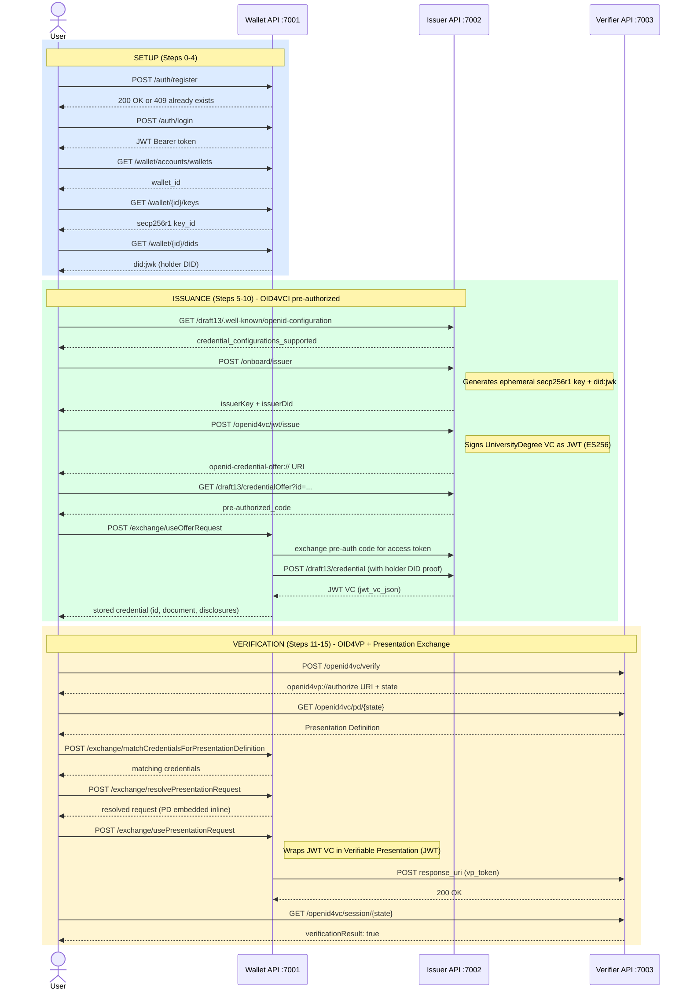
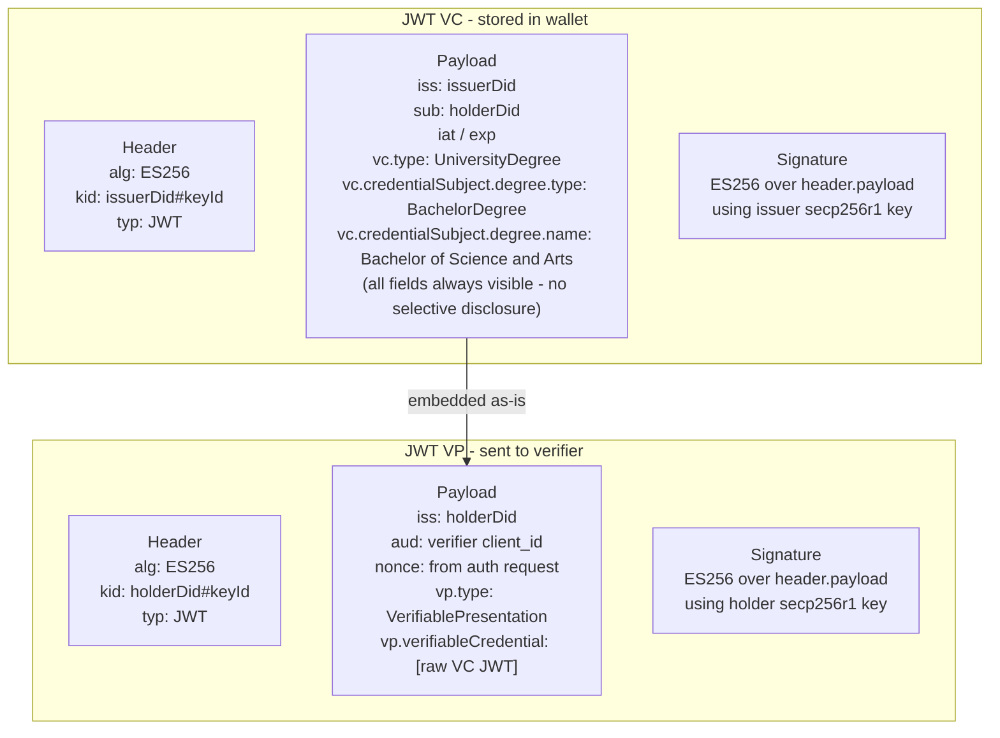

# W3C VC/VP (JWT) End-to-End Flow — Detailed Input/Output Reference

**Script:** `test-vc-vp-flow.sh`  
**Spec:** W3C Verifiable Credentials Data Model 1.1 (jwt_vc_json), OID4VCI (pre-authorized code), OID4VP (Presentation Exchange 2.0)  
**Run command:** `./test-vc-vp-flow.sh [--verbose|-v] [email] [password]`  
**Log file:** `test-vc-vp-flow.log` — captured with `./test-vc-vp-flow.sh --verbose > test-vc-vp-flow.log 2>&1`

---

## Services

| Service      | Base URL                            | Purpose                           |
|--------------|-------------------------------------|-----------------------------------|
| Wallet API   | `http://localhost:7001/wallet-api`  | Holder wallet (keys, DIDs, creds) |
| Issuer API   | `http://localhost:7002`             | JWT VC credential issuer          |
| Verifier API | `http://localhost:7003`             | OID4VP verifier                   |

---

## Flow Overview



---

## What is W3C JWT VC / VP?

A **Verifiable Credential (VC)** is a JSON-LD document expressing claims about a subject, signed by an issuer. In the **jwt_vc_json** format the credential is encoded as a JWT:

- **Header**: `alg: ES256`, `kid: <issuerDid>#<keyId>`
- **Payload**: standard JWT claims (`iss`, `sub`, `iat`, `exp`) + `vc` object containing credential type and subject claims
- **Signature**: ECDSA over secp256r1 (P-256)

A **Verifiable Presentation (VP)** wraps one or more VCs in a JWT signed by the holder, proving possession of the VC:

- **Header**: `alg: ES256`, `kid: <holderDid>#<keyId>`
- **Payload**: `vp` object with `verifiableCredential` array + `nonce` + `aud`
- **Signature**: Holder's key signs the presentation

Unlike SD-JWT VC, standard JWT VC does **not** support selective disclosure — the entire credential is revealed in the presentation.

---

## Step-by-Step Reference

---

### Step 0 — Register Account

**Purpose:** Create a wallet account. If the account already exists (HTTP 409), the script continues.

**Input (POST `http://localhost:7001/wallet-api/auth/register`):**
```json
{
  "type": "email",
  "name": "Test",
  "email": "test@email.com",
  "password": "test"
}
```

**Output:**
- HTTP 200/201 → account created
- HTTP 409 → account already exists; script continues

**Actual result from run:**
```
HTTP 409 — account may already exist, continuing...
```

---

### Step 1 — Login

**Purpose:** Authenticate and obtain a Bearer JWT for all subsequent wallet API calls.

**Input (POST `http://localhost:7001/wallet-api/auth/login`):**
```json
{
  "type": "email",
  "email": "test@email.com",
  "password": "test"
}
```

**Output:**
```json
{
  "id": "c798f9a8-32e1-40ec-b75a-67c3e21e332f",
  "token": "eyJhbGciOiJIUzI1NiJ9.eyJuYmYiOjE3Nzk2NzY2OTYs...",
  "username": "test@email.com"
}
```

The `token` is a HS256 JWT used as `Authorization: Bearer <token>` on all wallet API calls.

---

### Step 2 — Retrieve Wallet ID

**Purpose:** Get the wallet UUID that scopes all credential and key operations.

**Input (GET `http://localhost:7001/wallet-api/wallet/accounts/wallets`):**  
No body. Bearer token in header.

**Output:**
```json
{
  "account": "c798f9a8-32e1-40ec-b75a-67c3e21e332f",
  "wallets": [
    {
      "id": "c3419873-07be-419c-89ad-0b7a352f2d70",
      "name": "Wallet of Test",
      "createdOn": "2026-05-22T05:26:11.760032Z",
      "permission": "ADMINISTRATE"
    }
  ]
}
```

---

### Step 3 — Retrieve Key

**Purpose:** List the cryptographic keys in the wallet. The wallet generates a secp256r1 key during account setup, used for the holder's DID and for signing VPs.

**Input (GET `http://localhost:7001/wallet-api/wallet/{id}/keys`):**  
No body. Bearer token in header.

**Output:**
```json
[
  {
    "algorithm": "secp256r1",
    "cryptoProvider": "[walt.id crypto private secp256r1 key]",
    "keyId": {
      "id": "kePnU9VEoCX4byyuLOczT1G1LOUJxWYH82EmNeOYvog"
    },
    "keyPair": {},
    "keysetHandle": null
  }
]
```

The `keyId.id` is the JWK thumbprint used as the `kid` in `did:jwk`.

---

### Step 4 — Retrieve DID

**Purpose:** Get the holder's DID. The wallet uses `did:jwk` — the DID document is derived directly from the public key JWK, without any registry lookup.

**Input (GET `http://localhost:7001/wallet-api/wallet/{id}/dids`):**  
No body. Bearer token in header.

**Output:**
```json
[
  {
    "did": "did:jwk:eyJrdHkiOiJFQyIsImNydiI6IlAtMjU2Iiwia2lkIjoia2VQblU5VkVvQ1g0Ynl5dUxPY3pUMUcxTE9VSnhXWUg4MkVtTmVPWXZvZyIsIngiOiJUMGlHa0tnMlpKaHg4VlZOTFhxbldWMXRpcC1mWEszQ3ZFQmNqUXczTkI4IiwieSI6IkJxejBETW1XaEtDUWxPdDVqMlY2RDdfaGRoZVFseEJZSUFTSUFncFFaX3cifQ",
    "alias": "Onboarding",
    "document": "{\"@context\":[\"https://www.w3.org/ns/did/v1\",...],\"id\":\"did:jwk:...\",\"verificationMethod\":[...]}"
  }
]
```

The `did:jwk` is the base64url-encoded public key JWK — it embeds the key directly in the DID string. The DID document is generated on the fly without any blockchain or registry.

---

### Step 5 — Retrieve Issuer Well-Known Config

**Purpose:** Discover the credential endpoint, supported grant types, and credential configurations.

**Input (GET `http://localhost:7002/draft13/.well-known/openid-configuration`):**  
No body.

**Output (key fields):**
```json
{
  "issuer": "http://host.docker.internal:7002/draft13",
  "credential_endpoint": "http://host.docker.internal:7002/draft13/credential",
  "token_endpoint": "http://host.docker.internal:7002/draft13/token",
  "grant_types_supported": [
    "authorization_code",
    "urn:ietf:params:oauth:grant-type:pre-authorized_code"
  ]
}
```

> **Note:** The issuer uses `host.docker.internal` because the wallet API runs inside Docker.

---

### Step 6 — Onboard Issuer

**Purpose:** Generate an ephemeral issuer keypair and DID for this issuance session. The issuer does not use a pre-configured persistent key — a fresh secp256r1 key is generated each run.

**Input (POST `http://localhost:7002/onboard/issuer`):**
```json
{
  "key": {
    "keyType": "secp256r1"
  }
}
```

**Output:**
```json
{
  "issuerKey": {
    "type": "jwk",
    "jwk": {
      "kty": "EC",
      "d": "nR-FTg4LippDGhDp-8h0_Q7uL73qgncmt6sQT8Zgoyo",
      "crv": "P-256",
      "kid": "jee5R161R9JScNrs-MJBaoaRWYcxefJfAkKAxVYPZGE",
      "x": "W5Qd-T0oVisnRS6y7Nd6ly2qXxDgxlC0fhtYU3YwJ2M",
      "y": "A1o52buSf7P2zsLULMPteT69mUsPuPlZlvnGHlBGCyc"
    }
  },
  "issuerDid": "did:jwk:eyJrdHkiOiJFQyIsImNydiI6IlAtMjU2Iiwia2lkIjoiamVlNVIxNjFSOUpTY05ycy1NSkJhb2FSV1ljeGVmSmZBa0tBeFZZUFpHRSIsIngiOiJXNVFkLVQwb1Zpc25SUzZ5N05kNmx5MnFYeERneGxDMGZodFlVM1l3SjJNIiwieSI6IkExbzUyYnVTZjdQMnpzTFVMTVB0ZVQ2OW1Vc1B1UGxabHZuR0hsQkdDeWMifQ"
}
```

Both `issuerKey` (private JWK) and `issuerDid` (derived from the public key) are used in Step 7 to sign the credential.

---

### Step 7 — Create Credential Offer (JWT VC)

**Purpose:** Issue a `UniversityDegree` Verifiable Credential. The issuer signs it as a JWT and creates an OID4VCI pre-authorized code offer.

**Input (POST `http://localhost:7002/openid4vc/jwt/issue`):**
```json
{
  "issuerKey": { "type": "jwk", "jwk": { "kty": "EC", "crv": "P-256", "..." } },
  "issuerDid": "did:jwk:...",
  "credentialConfigurationId": "UniversityDegree_jwt_vc_json",
  "credentialData": {
    "@context": [
      "https://www.w3.org/2018/credentials/v1",
      "https://www.w3.org/2018/credentials/examples/v1"
    ],
    "id": "http://example.gov/credentials/3732",
    "type": ["VerifiableCredential", "UniversityDegree"],
    "issuer": { "id": "did:web:vc.transmute.world" },
    "issuanceDate": "2020-03-10T04:24:12.164Z",
    "credentialSubject": {
      "id": "did:example:ebfeb1f712ebc6f1c276e12ec21",
      "degree": {
        "type": "BachelorDegree",
        "name": "Bachelor of Science and Arts"
      }
    }
  },
  "mapping": {
    "id": "<uuid>",
    "issuer": { "id": "<issuerDid>" },
    "credentialSubject": { "id": "<subjectDid>" },
    "issuanceDate": "<timestamp>",
    "expirationDate": "<timestamp-in:365d>"
  },
  "authenticationMethod": "PRE_AUTHORIZED",
  "standardVersion": "DRAFT13"
}
```

| Field                    | Description                                                    |
|--------------------------|----------------------------------------------------------------|
| `issuerKey`              | Ephemeral private JWK from Step 6 — signs the JWT VC          |
| `issuerDid`              | Issuer's DID embedded in `iss` claim                           |
| `credentialConfigurationId` | Maps to the credential type in the well-known config        |
| `credentialData`         | W3C VC JSON-LD document (template)                             |
| `mapping`                | Dynamic value substitution: `<issuerDid>`, `<subjectDid>`, timestamps |
| `authenticationMethod`   | `PRE_AUTHORIZED` — wallet receives the credential without user login |

**Output:**
```
openid-credential-offer://?credential_offer_uri=http%3A%2F%2Fhost.docker.internal%3A7002%2Fdraft13%2FcredentialOffer%3Fid%3Dfae4729f-627e-45c1-be93-892067abadb5
```

---

### Step 8/9 — Inspect Offer Content

**Purpose:** Dereference the credential offer URI to see the pre-authorized code.

**Input (GET `http://localhost:7002/draft13/credentialOffer?id={id}`):**  
No body.

**Output:**
```json
{
  "credential_issuer": "http://host.docker.internal:7002/draft13",
  "credential_configuration_ids": ["UniversityDegree_jwt_vc_json"],
  "grants": {
    "urn:ietf:params:oauth:grant-type:pre-authorized_code": {
      "pre-authorized_code": "eyJ...",
      "interval": 5
    }
  }
}
```

The `pre-authorized_code` is a short-lived JWT. The wallet exchanges it for an access token at the token endpoint, then uses that access token to call the credential endpoint.

---

### Step 10 — Claim JWT VC into Wallet

**Purpose:** The wallet completes the OID4VCI flow: fetches offer → token exchange → credential request → stores the JWT VC.

**Input (POST `http://localhost:7001/wallet-api/wallet/{id}/exchange/useOfferRequest`):**
```
openid-credential-offer://?credential_offer_uri=http%3A%2F%2Fhost.docker.internal%3A7002%2Fdraft13%2FcredentialOffer%3Fid%3Dfae4729f-627e-45c1-be93-892067abadb5
```
(plain text body — the URI string directly)

**Output:**
```json
[
  {
    "wallet": "c3419873-07be-419c-89ad-0b7a352f2d70",
    "id": "urn:uuid:d4c01b3e-600e-4252-bfb0-b24831fb502e",
    "document": "eyJraWQiOiJkaWQ6andrOmV5SnJkSGtpT2lKRlF5...",
    "addedOn": "2026-05-25T02:31:36Z",
    "pending": false,
    "format": "jwt_vc_json",
    "parsedDocument": {
      "@context": [
        "https://www.w3.org/2018/credentials/v1",
        "https://www.w3.org/2018/credentials/examples/v1"
      ],
      "type": ["VerifiableCredential", "UniversityDegree"],
      "credentialSubject": {
        "id": "did:jwk:...",
        "degree": {
          "type": "BachelorDegree",
          "name": "Bachelor of Science and Arts"
        }
      },
      "issuer": "did:jwk:...",
      "issuanceDate": "2026-05-25T02:31:36Z",
      "expirationDate": "2027-05-25T02:31:36Z",
      "id": "urn:uuid:d4c01b3e-600e-4252-bfb0-b24831fb502e"
    }
  }
]
```

Key fields:
- `format: "jwt_vc_json"` — W3C VC encoded as a JWT
- `document` — the raw JWT (header.payload.signature)
- `parsedDocument` — decoded credential claims
- `credentialSubject.id` — set to the holder's `did:jwk` (from `<subjectDid>` mapping)
- `issuer` — set to the issuer's `did:jwk` (from `<issuerDid>` mapping)

---

### Step 11 — Create Authorization Request (Verifier)

**Purpose:** The verifier creates an OID4VP authorization request specifying which credential type and format it requires.

**Input (POST `http://localhost:7003/openid4vc/verify`):**
```
Headers:
  authorizeBaseUrl: openid4vp://authorize
  responseMode: direct_post
  (no openId4VPProfile header → default PE 2.0 profile)
```
```json
{
  "request_credentials": [
    {
      "type": "UniversityDegree",
      "format": "jwt_vc_json"
    }
  ]
}
```

**Output:**
```
openid4vp://authorize
  ?response_type=vp_token
  &client_id=http%3A%2F%2Fhost.docker.internal%3A7003%2Fopenid4vc%2Fverify
  &response_mode=direct_post
  &state=iwPkK5R4X46k
  &presentation_definition_uri=http%3A%2F%2Fhost.docker.internal%3A7003%2Fopenid4vc%2Fpd%2FiwPkK5R4X46k
  &client_id_scheme=redirect_uri
  &client_metadata=%7B%22authorization_encrypted_response_alg%22%3A%22ECDH-ES%22%2C...%7D
  &nonce=7d50101a-6505-4d59-81a2-ed3cf5fafa9d
  &response_uri=http%3A%2F%2Fhost.docker.internal%3A7003%2Fopenid4vc%2Fverify%2FiwPkK5R4X46k
```

The `state` value (`iwPkK5R4X46k`) is the session ID used in Steps 12-15.

> **Difference from mDoc flow:** Uses `responseMode: direct_post` (not `direct_post_jwt`) and the default PE 2.0 profile (not ISO 18013-7). The presentation definition is at a URI rather than in a JAR JWT.

---

### Step 12 — Match Credentials for Presentation Definition

**Purpose:** Fetch the Presentation Definition from the verifier and find which wallet credentials satisfy it.

**Step 12a — Fetch Presentation Definition (GET `/openid4vc/pd/{state}`):**

**Output:**
```json
{
  "id": "n1aNQpJIPaK5",
  "input_descriptors": [
    {
      "id": "UniversityDegree",
      "format": {
        "jwt_vc_json": { "alg": ["EdDSA"] }
      },
      "constraints": {
        "fields": [
          {
            "path": ["$.vc.type"],
            "filter": {
              "type": "string",
              "pattern": "UniversityDegree"
            }
          }
        ]
      }
    }
  ]
}
```

The `$.vc.type` path filters on the credential type inside the JWT payload's `vc` object.

**Step 12b — Match Credentials (POST `.../exchange/matchCredentialsForPresentationDefinition`):**

Input: the Presentation Definition JSON above.

**Output:**
```json
[
  {
    "wallet": "c3419873-07be-419c-89ad-0b7a352f2d70",
    "id": "urn:uuid:d4c01b3e-600e-4252-bfb0-b24831fb502e",
    "document": "eyJraWQiOiJkaWQ6andrOmV5SnJk...",
    "format": "jwt_vc_json",
    "parsedDocument": { "type": ["VerifiableCredential", "UniversityDegree"], "..." }
  }
]
```

The wallet returns the `UniversityDegree` credential issued in Step 10, confirming it matches the `$.vc.type` filter.

---

### Step 13 — Resolve Presentation Request

**Purpose:** The wallet resolves the authorization request, replacing `presentation_definition_uri` with the actual `presentation_definition` JSON inline.

**Input (POST `.../exchange/resolvePresentationRequest`):**  
Body: the raw `openid4vp://authorize?...` URI string

**Output:** An expanded `openid4vp://authorize?...` URI with `presentation_definition` URL-encoded inline (the URI from Step 11 with `presentation_definition_uri` replaced by `presentation_definition=%7B...%7D`).

This resolved URI is passed to `usePresentationRequest` so the wallet has the full PD locally without a follow-up HTTP call.

---

### Step 14 — Fulfill Presentation Request

**Purpose:** The wallet builds a Verifiable Presentation (JWT VP) wrapping the selected credential and POSTs it to the verifier.

**Input (POST `.../exchange/usePresentationRequest`):**
```json
{
  "presentationRequest": "openid4vp://authorize?...&presentation_definition=...",
  "selectedCredentials": ["urn:uuid:d4c01b3e-600e-4252-bfb0-b24831fb502e"]
}
```

Internally the wallet:
1. Decodes the presentation definition from the request
2. Wraps the selected JWT VC in a VP JWT:
   - `vp.verifiableCredential` array with the raw JWT VC
   - `aud` = verifier's `client_id`
   - `nonce` from the authorization request
   - Signs the VP JWT with the holder's secp256r1 key
3. POSTs `vp_token=<VP JWT>` to the `response_uri`

**Output:**
```json
{ "redirectUri": null }
```

---

### Step 15 — Verify Credential Presentation

**Purpose:** Poll the verifier's session endpoint to confirm the VP was accepted.

**Input (GET `http://localhost:7003/openid4vc/session/{state}`):**  
No body.

**Output:**
```json
{
  "id": "iwPkK5R4X46k",
  "verificationResult": true,
  "policyResults": {
    "credentialResults": [
      {
        "credential": { "type": ["VerifiableCredential", "UniversityDegree"], "..." },
        "policyResults": [
          { "policy": "signature", "isSuccess": true },
          { "policy": "expired", "isSuccess": true },
          { "policy": "not-before", "isSuccess": true },
          { "policy": "presentation-definition", "isSuccess": true }
        ]
      }
    ]
  }
}
```

The verifier validates:
1. VP JWT signature (holder's key matches `sub` in the VC)
2. VC JWT signature (issuer's `did:jwk` public key)
3. Credential not expired
4. Credential type matches the Presentation Definition

---

## JWT VC Structure



---

## Comparison: VC-VP vs SD-JWT VC vs mDoc

| Aspect                  | W3C JWT VC/VP              | SD-JWT VC                          | ISO mDoc                            |
|-------------------------|----------------------------|------------------------------------|-------------------------------------|
| **Format**              | JWT (jwt_vc_json)          | JWT + disclosures                  | CBOR (mso_mdoc)                     |
| **Credential data**     | All claims in JWT body     | Some claims as `_sd` hashes        | All fields as digestID + salt pairs |
| **Selective disclosure**| Not supported              | Yes — per-field hash commitments   | Yes — per-field digest map          |
| **Holder binding**      | VP JWT signature           | KB-JWT signature                   | DeviceAuth CBOR signature           |
| **Issuer trust**        | DID + JWK (did:jwk)        | DID + JWK (did:jwk)                | X.509 cert chain (IACA → DS)        |
| **OID4VP profile**      | Default (PE 2.0)           | Default (PE 2.0)                   | ISO_18013_7_MDOC                    |
| **Response mode**       | `direct_post`              | `direct_post_jwt`                  | `direct_post_jwt`                   |
| **Verifier sees**       | All credential fields      | Only disclosed fields              | Only requested namespace fields     |
| **Key algorithm**       | ES256 (secp256r1)          | ES256 (secp256r1)                  | ES256 (P-256) + X.509               |
| **Script**              | `test-vc-vp-flow.sh`       | `test-sd-jwt-flow.sh`              | `test-mdoc-flow.sh`                 |

---

## Verbose Mode

Run with `--verbose` or `-v` to enable per-step request/response logging:

```bash
./test-vc-vp-flow.sh --verbose
```

To capture all output to a plain-text log file:

```bash
./test-vc-vp-flow.sh --verbose > test-vc-vp-flow.log 2>&1
```

> Colors are automatically disabled when stdout is redirected, so the log file contains clean plain text.

Each step prints:
```
  ┌── Step N ─── METHOD URL
  │  REQUEST:
  │   { ... json ... }
  │  RESPONSE:
  │   { ... json ... }
  └──
```

The verbose log is also written as JSON to `demo/jwtvc-steps.json` on successful completion.
